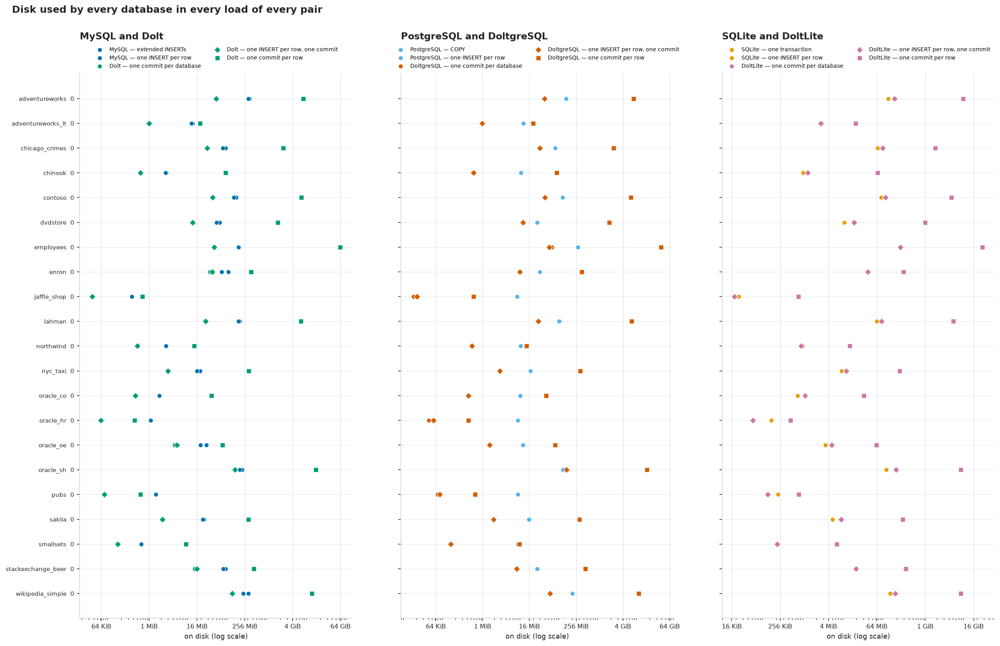
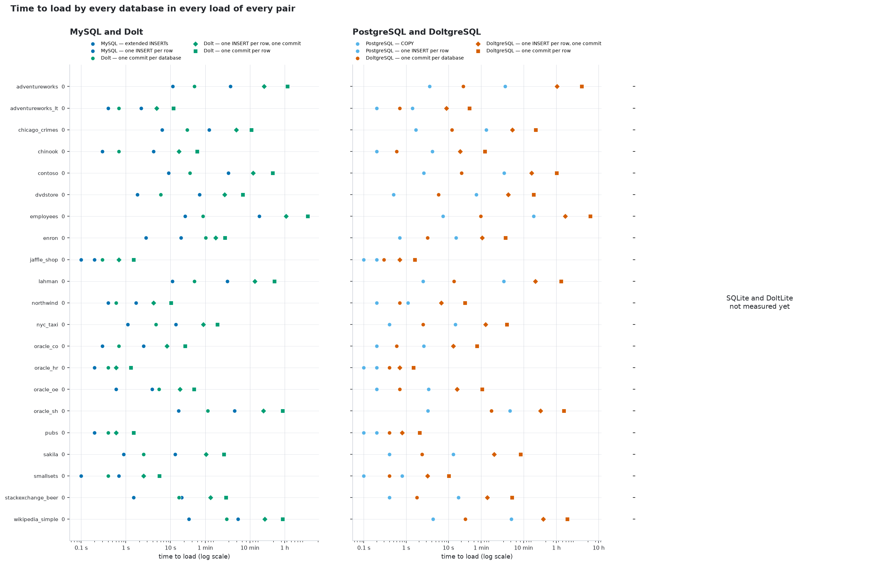
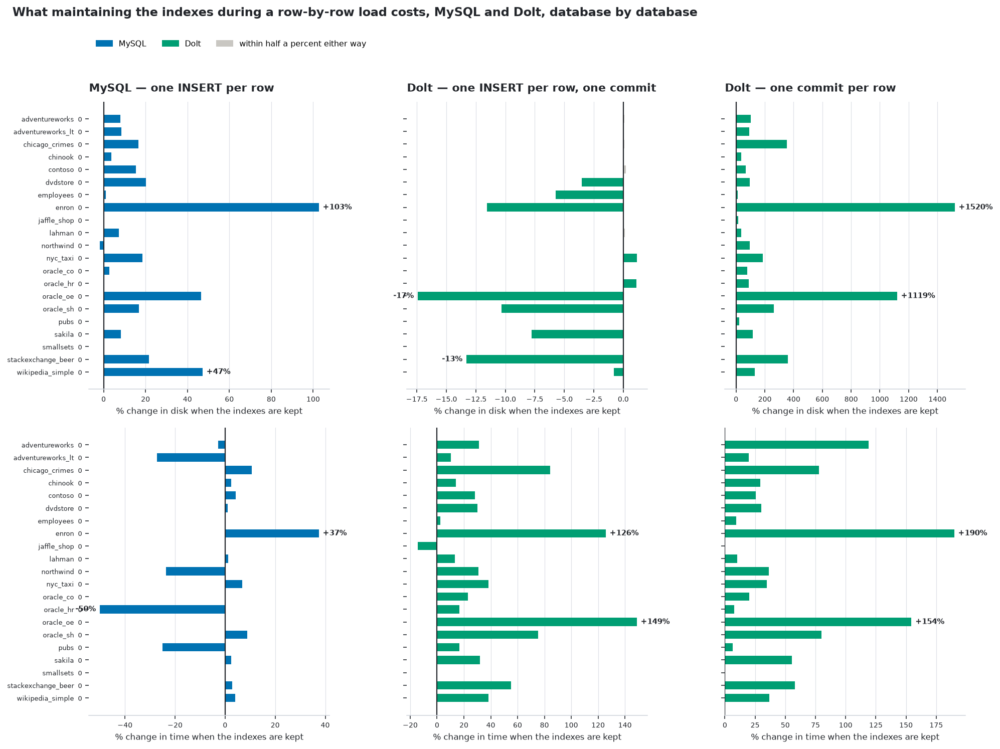
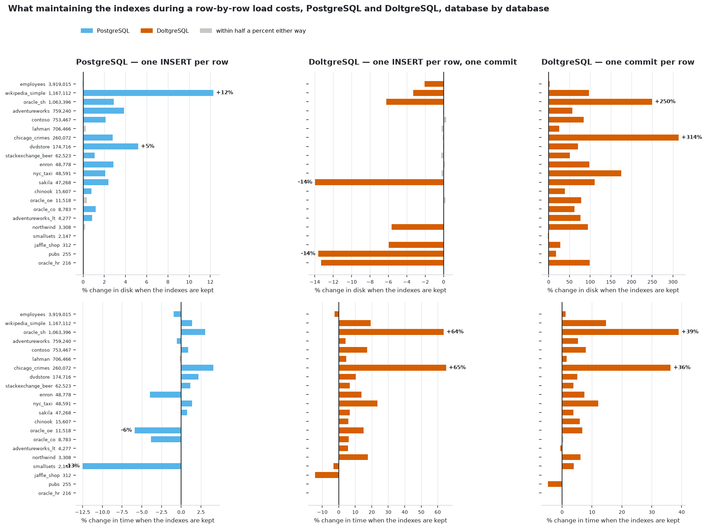
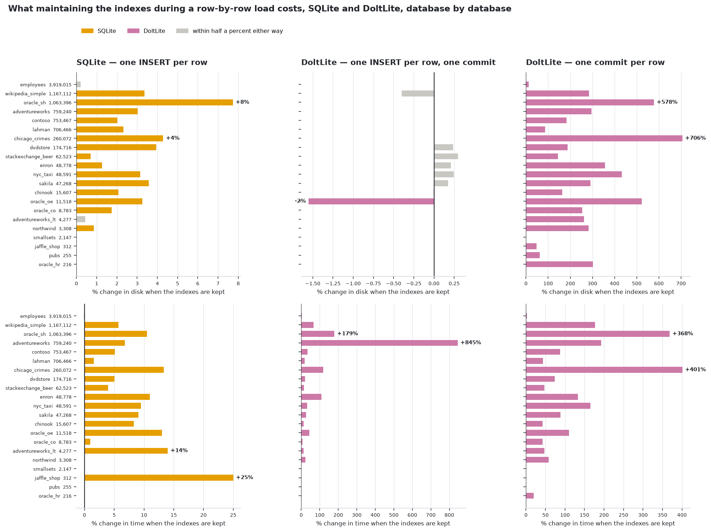

<!-- Generated by scripts/render.py from docs/templates/REPORT.md and the files in
     build/. Do not edit this file: `make docs` overwrites it, and every number
     in it comes from a measurement rather than from anyone's memory. -->

# The evidence

Every table and figure behind [README.md](README.md), for all three pairs -- MySQL and Dolt, PostgreSQL and DoltgreSQL, SQLite and DoltLite -- database by database, load by load, both index policies, the loads' memory, what each engine refused, and how every load is performed and measured. **No number in this file was typed by a person**: it is generated by `scripts/render.py` from `docs/templates/REPORT.md` and the measurement files in `build/`, and `make check` fails if it disagrees with them.

* [The machine](#the-machine)
* [Every load, every database, every pair](#every-load-every-database-every-pair) -- one table per pair, then [every engine side by side](#every-engine-side-by-side)
* [What maintaining the indexes costs, database by database](#what-maintaining-the-indexes-costs-database-by-database)
* [What each engine refused](#what-each-engine-refused)
* [Memory](#memory)
* [The tests](#the-tests), [how each load is performed](#how-each-load-is-performed), [how each load is measured](#how-each-load-is-measured)
* [The MySQL and Dolt pair, in the report's own words](#the-mysql-and-dolt-pair-in-the-reports-own-words)

## The machine

| | |
|---|---|
| CPU | AMD Ryzen Threadripper 3970X 32-Core Processor (64 threads) |
| Memory | 30.2 GiB |
| Disk | 3.6 TiB ext4 |
| Kernel | 7.0.0-34-generic |
| Containers | Podman 5.7.0, rootless, through Docker's client 29.8.2; storage driver `overlay` |
| Shared with | 4 other containers running at capture, belonging to other work on the host; 14.8 GiB memory available |
| MySQL | `mysql@sha256:e2bde46db6563855d7177adb5f0b57b9dc663f5a20927a90f4259d3312068497` — /usr/sbin/mysqld  Ver 9.7.2 for Linux on x86_64 (MySQL Community Server - GPL), named by image digest |
| Dolt | `dolthub/dolt-sql-server` — dolt version 2.4.0, named by image digest |
| PostgreSQL | `postgres` — postgres (PostgreSQL) 18.6 (Debian 18.6-1.pgdg12+2), named by image digest |
| DoltgreSQL | `dolthub/doltgresql` — 1.4.0, named by image digest |
| DoltLite | `doltsamples-doltlite:0.50.14` — DoltLite v0.50.14 (SQLite 3.54.0, 64-bit), named by package checksums, beside sqlite3 3.53.4 2026-07-24 19:02:57 bf7c7f30031888f4e796e429ab3978879485813aaca6f641c7b33e4e09459bcc (64-bit) |
| Tuning | no performance tuning — stock images, stock storage settings; MySQL is started with the two flags below |
| MySQL flags | `--local-infile=1`, `--skip-log-bin` |

## Every load, every database, every pair

One table per pair, the same five loads across, every database down.

### MySQL and Dolt

<table>
<thead>
<tr><th rowspan="2" align="left">database</th><th rowspan="2" align="right" nowrap>rows</th><th colspan="2" align="center">MySQL <small>the baseline</small></th><th colspan="3" align="center" style="background:#eef3f8;color:#24292f" bgcolor="#eef3f8">Dolt <small>the Dolt engine</small></th></tr>
<tr><th align="right" nowrap>1. extended INSERTs</th><th align="right" nowrap>2. 1 INSERT/row</th><th align="right" nowrap style="background:#eef3f8;color:#24292f" bgcolor="#eef3f8">3. 1 commit/db</th><th align="right" nowrap style="background:#eef3f8;color:#24292f" bgcolor="#eef3f8">4. 1 INSERT/row</th><th align="right" nowrap style="background:#fdf1dc;color:#24292f" bgcolor="#fdf1dc">5. 1 commit/row</th></tr>
</thead>
<tbody>
<tr><td align="left"><code>adventureworks</code></td><td align="right" nowrap>0</td><td align="right" nowrap>335.9 MiB 11 s</td><td align="right" nowrap>311.0 MiB <b>0.93×</b> 3 min 42 s</td><td align="right" nowrap style="background:#eef3f8;color:#24292f" bgcolor="#eef3f8">49.4 MiB <b>0.15×</b> 34 s</td><td align="right" nowrap style="background:#eef3f8;color:#24292f" bgcolor="#eef3f8">49.1 MiB <b>0.15×</b> 20 min 42 s</td><td align="right" nowrap style="background:#fdf1dc;color:#24292f" bgcolor="#fdf1dc">7.4 GiB <b>23×</b> 1 h 08 min</td></tr>
<tr><td align="left"><code>adventureworks_lt</code></td><td align="right" nowrap>0</td><td align="right" nowrap>12.5 MiB 0.4 s</td><td align="right" nowrap>11.5 MiB <b>0.92×</b> 2.2 s</td><td align="right" nowrap style="background:#eef3f8;color:#24292f" bgcolor="#eef3f8">1.0 MiB <b>0.08×</b> 0.7 s</td><td align="right" nowrap style="background:#eef3f8;color:#24292f" bgcolor="#eef3f8">1.0 MiB <b>0.08×</b> 4.9 s</td><td align="right" nowrap style="background:#fdf1dc;color:#24292f" bgcolor="#fdf1dc">19.3 MiB <b>1.55×</b> 12 s</td></tr>
<tr><td align="left"><code>chicago_crimes</code></td><td align="right" nowrap>0</td><td align="right" nowrap>84.1 MiB 6.5 s</td><td align="right" nowrap>72.1 MiB <b>0.86×</b> 1 min 13 s</td><td align="right" nowrap style="background:#eef3f8;color:#24292f" bgcolor="#eef3f8">28.8 MiB <b>0.34×</b> 24 s</td><td align="right" nowrap style="background:#eef3f8;color:#24292f" bgcolor="#eef3f8">28.8 MiB <b>0.34×</b> 4 min 57 s</td><td align="right" nowrap style="background:#fdf1dc;color:#24292f" bgcolor="#fdf1dc">2.3 GiB <b>28×</b> 10 min 46 s</td></tr>
<tr><td align="left"><code>chinook</code></td><td align="right" nowrap>0</td><td align="right" nowrap>2.7 MiB 0.3 s</td><td align="right" nowrap>2.6 MiB <b>0.97×</b> 4.2 s</td><td align="right" nowrap style="background:#eef3f8;color:#24292f" bgcolor="#eef3f8">615.0 KiB <b>0.22×</b> 0.7 s</td><td align="right" nowrap style="background:#eef3f8;color:#24292f" bgcolor="#eef3f8">615.0 KiB <b>0.22×</b> 16 s</td><td align="right" nowrap style="background:#fdf1dc;color:#24292f" bgcolor="#fdf1dc">83.5 MiB <b>31×</b> 40 s</td></tr>
<tr><td align="left"><code>contoso</code></td><td align="right" nowrap>0</td><td align="right" nowrap>156.3 MiB 9.1 s</td><td align="right" nowrap>135.3 MiB <b>0.87×</b> 3 min 17 s</td><td align="right" nowrap style="background:#eef3f8;color:#24292f" bgcolor="#eef3f8">39.5 MiB <b>0.25×</b> 27 s</td><td align="right" nowrap style="background:#eef3f8;color:#24292f" bgcolor="#eef3f8">39.2 MiB <b>0.25×</b> 11 min 50 s</td><td align="right" nowrap style="background:#fdf1dc;color:#24292f" bgcolor="#fdf1dc">6.6 GiB <b>44×</b> 32 min 03 s</td></tr>
<tr><td align="left"><code>dvdstore</code></td><td align="right" nowrap>0</td><td align="right" nowrap>60.3 MiB 1.8 s</td><td align="right" nowrap>50.0 MiB <b>0.83×</b> 45 s</td><td align="right" nowrap style="background:#eef3f8;color:#24292f" bgcolor="#eef3f8">11.9 MiB <b>0.20×</b> 6.0 s</td><td align="right" nowrap style="background:#eef3f8;color:#24292f" bgcolor="#eef3f8">12.4 MiB <b>0.21×</b> 2 min 41 s</td><td align="right" nowrap style="background:#fdf1dc;color:#24292f" bgcolor="#fdf1dc">1.7 GiB <b>28×</b> 6 min 57 s</td></tr>
<tr><td align="left"><code>employees</code></td><td align="right" nowrap>0</td><td align="right" nowrap>178.3 MiB 21 s</td><td align="right" nowrap>176.3 MiB <b>0.99×</b> 16 min 20 s</td><td align="right" nowrap style="background:#eef3f8;color:#24292f" bgcolor="#eef3f8">42.5 MiB <b>0.24×</b> 54 s</td><td align="right" nowrap style="background:#eef3f8;color:#24292f" bgcolor="#eef3f8">43.5 MiB <b>0.24×</b> 1 h 03 min</td><td align="right" nowrap style="background:#fdf1dc;color:#24292f" bgcolor="#fdf1dc">62.0 GiB <b>356×</b> 3 h 15 min</td></tr>
<tr><td align="left"><code>enron</code></td><td align="right" nowrap>0</td><td align="right" nowrap>98.2 MiB 2.8 s</td><td align="right" nowrap>66.2 MiB <b>0.67×</b> 17 s</td><td align="right" nowrap style="background:#eef3f8;color:#24292f" bgcolor="#eef3f8">34.1 MiB <b>0.35×</b> 1 min 01 s</td><td align="right" nowrap style="background:#eef3f8;color:#24292f" bgcolor="#eef3f8">38.6 MiB <b>0.39×</b> 1 min 43 s</td><td align="right" nowrap style="background:#fdf1dc;color:#24292f" bgcolor="#fdf1dc">370.0 MiB <b>3.77×</b> 2 min 46 s</td></tr>
<tr><td align="left"><code>jaffle_shop</code></td><td align="right" nowrap>0</td><td align="right" nowrap>372.0 KiB 0.1 s</td><td align="right" nowrap>372.0 KiB <b>1.00×</b> 0.2 s</td><td align="right" nowrap style="background:#eef3f8;color:#24292f" bgcolor="#eef3f8">37.7 KiB <b>0.10×</b> 0.3 s</td><td align="right" nowrap style="background:#eef3f8;color:#24292f" bgcolor="#eef3f8">37.7 KiB <b>0.10×</b> 0.7 s</td><td align="right" nowrap style="background:#fdf1dc;color:#24292f" bgcolor="#fdf1dc">686.0 KiB <b>1.84×</b> 1.5 s</td></tr>
<tr><td align="left"><code>lahman</code></td><td align="right" nowrap>0</td><td align="right" nowrap>191.8 MiB 11 s</td><td align="right" nowrap>178.9 MiB <b>0.93×</b> 3 min 08 s</td><td align="right" nowrap style="background:#eef3f8;color:#24292f" bgcolor="#eef3f8">26.3 MiB <b>0.14×</b> 34 s</td><td align="right" nowrap style="background:#eef3f8;color:#24292f" bgcolor="#eef3f8">26.3 MiB <b>0.14×</b> 12 min 57 s</td><td align="right" nowrap style="background:#fdf1dc;color:#24292f" bgcolor="#fdf1dc">6.5 GiB <b>35×</b> 35 min 29 s</td></tr>
<tr><td align="left"><code>northwind</code></td><td align="right" nowrap>0</td><td align="right" nowrap>2.6 MiB 0.4 s</td><td align="right" nowrap>2.7 MiB <b>1.02×</b> 1.7 s</td><td align="right" nowrap style="background:#eef3f8;color:#24292f" bgcolor="#eef3f8">518.5 KiB <b>0.19×</b> 0.6 s</td><td align="right" nowrap style="background:#eef3f8;color:#24292f" bgcolor="#eef3f8">518.5 KiB <b>0.19×</b> 4.2 s</td><td align="right" nowrap style="background:#fdf1dc;color:#24292f" bgcolor="#fdf1dc">13.5 MiB <b>5.13×</b> 10 s</td></tr>
<tr><td align="left"><code>nyc_taxi</code></td><td align="right" nowrap>0</td><td align="right" nowrap>19.1 MiB 1.1 s</td><td align="right" nowrap>16.1 MiB <b>0.84×</b> 13 s</td><td align="right" nowrap style="background:#eef3f8;color:#24292f" bgcolor="#eef3f8">3.0 MiB <b>0.16×</b> 4.7 s</td><td align="right" nowrap style="background:#eef3f8;color:#24292f" bgcolor="#eef3f8">3.0 MiB <b>0.16×</b> 54 s</td><td align="right" nowrap style="background:#fdf1dc;color:#24292f" bgcolor="#fdf1dc">321.1 MiB <b>17×</b> 1 min 52 s</td></tr>
<tr><td align="left"><code>oracle_co</code></td><td align="right" nowrap>0</td><td align="right" nowrap>1.8 MiB 0.3 s</td><td align="right" nowrap>1.8 MiB <b>0.97×</b> 2.5 s</td><td align="right" nowrap style="background:#eef3f8;color:#24292f" bgcolor="#eef3f8">456.3 KiB <b>0.24×</b> 0.7 s</td><td align="right" nowrap style="background:#eef3f8;color:#24292f" bgcolor="#eef3f8">456.1 KiB <b>0.24×</b> 8.3 s</td><td align="right" nowrap style="background:#fdf1dc;color:#24292f" bgcolor="#fdf1dc">36.8 MiB <b>20×</b> 21 s</td></tr>
<tr><td align="left"><code>oracle_hr</code></td><td align="right" nowrap>0</td><td align="right" nowrap>1.1 MiB 0.2 s</td><td align="right" nowrap>1.1 MiB <b>1.00×</b> 0.4 s</td><td align="right" nowrap style="background:#eef3f8;color:#24292f" bgcolor="#eef3f8">62.8 KiB <b>0.06×</b> 0.4 s</td><td align="right" nowrap style="background:#eef3f8;color:#24292f" bgcolor="#eef3f8">62.1 KiB <b>0.06×</b> 0.6 s</td><td align="right" nowrap style="background:#fdf1dc;color:#24292f" bgcolor="#fdf1dc">444.7 KiB <b>0.40×</b> 1.3 s</td></tr>
<tr><td align="left"><code>oracle_oe</code></td><td align="right" nowrap>0</td><td align="right" nowrap>27.7 MiB 0.6 s</td><td align="right" nowrap>19.6 MiB <b>0.71×</b> 3.9 s</td><td align="right" nowrap style="background:#eef3f8;color:#24292f" bgcolor="#eef3f8">4.3 MiB <b>0.16×</b> 5.5 s</td><td align="right" nowrap style="background:#eef3f8;color:#24292f" bgcolor="#eef3f8">5.1 MiB <b>0.18×</b> 16 s</td><td align="right" nowrap style="background:#fdf1dc;color:#24292f" bgcolor="#fdf1dc">70.1 MiB <b>2.53×</b> 34 s</td></tr>
<tr><td align="left"><code>oracle_sh</code></td><td align="right" nowrap>0</td><td align="right" nowrap>220.2 MiB 15 s</td><td align="right" nowrap>188.4 MiB <b>0.86×</b> 4 min 34 s</td><td align="right" nowrap style="background:#eef3f8;color:#24292f" bgcolor="#eef3f8">143.3 MiB <b>0.65×</b> 1 min 08 s</td><td align="right" nowrap style="background:#eef3f8;color:#24292f" bgcolor="#eef3f8">143.4 MiB <b>0.65×</b> 19 min 56 s</td><td align="right" nowrap style="background:#fdf1dc;color:#24292f" bgcolor="#fdf1dc">15.4 GiB <b>72×</b> 54 min 26 s</td></tr>
<tr><td align="left"><code>pubs</code></td><td align="right" nowrap>0</td><td align="right" nowrap>1.5 MiB 0.2 s</td><td align="right" nowrap>1.5 MiB <b>1.00×</b> 0.4 s</td><td align="right" nowrap style="background:#eef3f8;color:#24292f" bgcolor="#eef3f8">77.0 KiB <b>0.05×</b> 0.4 s</td><td align="right" nowrap style="background:#eef3f8;color:#24292f" bgcolor="#eef3f8">77.0 KiB <b>0.05×</b> 0.6 s</td><td align="right" nowrap style="background:#fdf1dc;color:#24292f" bgcolor="#fdf1dc">625.3 KiB <b>0.42×</b> 1.5 s</td></tr>
<tr><td align="left"><code>sakila</code></td><td align="right" nowrap>0</td><td align="right" nowrap>24.1 MiB 0.9 s</td><td align="right" nowrap>22.3 MiB <b>0.92×</b> 13 s</td><td align="right" nowrap style="background:#eef3f8;color:#24292f" bgcolor="#eef3f8">2.1 MiB <b>0.09×</b> 2.5 s</td><td align="right" nowrap style="background:#eef3f8;color:#24292f" bgcolor="#eef3f8">2.2 MiB <b>0.09×</b> 1 min 02 s</td><td align="right" nowrap style="background:#fdf1dc;color:#24292f" bgcolor="#fdf1dc">314.5 MiB <b>13×</b> 2 min 36 s</td></tr>
<tr><td align="left"><code>smallsets</code></td><td align="right" nowrap>0</td><td align="right" nowrap>644.0 KiB 0.1 s</td><td align="right" nowrap>644.0 KiB <b>1.00×</b> 0.7 s</td><td align="right" nowrap style="background:#eef3f8;color:#24292f" bgcolor="#eef3f8">164.3 KiB <b>0.26×</b> 0.4 s</td><td align="right" nowrap style="background:#eef3f8;color:#24292f" bgcolor="#eef3f8">164.3 KiB <b>0.26×</b> 2.5 s</td><td align="right" nowrap style="background:#fdf1dc;color:#24292f" bgcolor="#fdf1dc">8.4 MiB <b>13×</b> 5.6 s</td></tr>
<tr><td align="left"><code>stackexchange_beer</code></td><td align="right" nowrap>0</td><td align="right" nowrap>83.6 MiB 1.5 s</td><td align="right" nowrap>73.6 MiB <b>0.88×</b> 18 s</td><td align="right" nowrap style="background:#eef3f8;color:#24292f" bgcolor="#eef3f8">14.0 MiB <b>0.17×</b> 16 s</td><td align="right" nowrap style="background:#eef3f8;color:#24292f" bgcolor="#eef3f8">16.1 MiB <b>0.19×</b> 1 min 18 s</td><td align="right" nowrap style="background:#fdf1dc;color:#24292f" bgcolor="#fdf1dc">431.2 MiB <b>5.16×</b> 2 min 55 s</td></tr>
<tr><td align="left"><code>wikipedia_simple</code></td><td align="right" nowrap>0</td><td align="right" nowrap>314.2 MiB 26 s</td><td align="right" nowrap>235.2 MiB <b>0.75×</b> 5 min 22 s</td><td align="right" nowrap style="background:#eef3f8;color:#24292f" bgcolor="#eef3f8">123.0 MiB <b>0.39×</b> 3 min 00 s</td><td align="right" nowrap style="background:#eef3f8;color:#24292f" bgcolor="#eef3f8">124.8 MiB <b>0.40×</b> 21 min 28 s</td><td align="right" nowrap style="background:#fdf1dc;color:#24292f" bgcolor="#fdf1dc">12.3 GiB <b>40×</b> 54 min 26 s</td></tr>
<tr><td align="left"><b>all 21 with every test</b></td><td align="right" nowrap><b>0</b></td><td align="right" nowrap><b>1.8 GiB 1 min 51 s</b></td><td align="right" nowrap><b>0.86× 21× time</b></td><td align="right" nowrap style="background:#eef3f8;color:#24292f" bgcolor="#eef3f8"><b>0.29× 4.7× time</b></td><td align="right" nowrap style="background:#eef3f8;color:#24292f" bgcolor="#eef3f8"><b>0.29× 89× time</b></td><td align="right" nowrap style="background:#fdf1dc;color:#24292f" bgcolor="#fdf1dc"><b>65× 255× time</b></td></tr>
</tbody>
</table>

### PostgreSQL and DoltgreSQL

<table>
<thead>
<tr><th rowspan="2" align="left">database</th><th rowspan="2" align="right" nowrap>rows</th><th colspan="2" align="center">PostgreSQL <small>the baseline</small></th><th colspan="3" align="center" style="background:#eef3f8;color:#24292f" bgcolor="#eef3f8">DoltgreSQL <small>the Dolt engine</small></th></tr>
<tr><th align="right" nowrap>1. COPY</th><th align="right" nowrap>2. 1 INSERT/row</th><th align="right" nowrap style="background:#eef3f8;color:#24292f" bgcolor="#eef3f8">3. 1 commit/db</th><th align="right" nowrap style="background:#eef3f8;color:#24292f" bgcolor="#eef3f8">4. 1 INSERT/row</th><th align="right" nowrap style="background:#fdf1dc;color:#24292f" bgcolor="#fdf1dc">5. 1 commit/row</th></tr>
</thead>
<tbody>
<tr><td align="left"><code>employees</code></td><td align="right" nowrap>3,919,015</td><td align="right" nowrap>282.9 MiB 7.5 s</td><td align="right" nowrap>283.3 MiB <b>1.00×</b> 17 min 17 s</td><td align="right" nowrap style="background:#eef3f8;color:#24292f" bgcolor="#eef3f8">60.7 MiB <b>0.21×</b> 58 s</td><td align="right" nowrap style="background:#eef3f8;color:#24292f" bgcolor="#eef3f8">52.0 MiB <b>0.18×</b> 1 h 37 min</td><td align="right" nowrap style="background:#fdf1dc;color:#24292f" bgcolor="#fdf1dc">38.4 GiB <b>139×</b> 6 h 19 min</td></tr>
<tr><td align="left"><code>wikipedia_simple</code></td><td align="right" nowrap>1,167,112</td><td align="right" nowrap>204.6 MiB 4.3 s</td><td align="right" nowrap>203.6 MiB <b>1.00×</b> 5 min 11 s</td><td align="right" nowrap style="background:#eef3f8;color:#24292f" bgcolor="#eef3f8">54.8 MiB <b>0.27×</b> 25 s</td><td align="right" nowrap style="background:#eef3f8;color:#24292f" bgcolor="#eef3f8">54.6 MiB <b>0.27×</b> 29 min 26 s</td><td align="right" nowrap style="background:#fdf1dc;color:#24292f" bgcolor="#fdf1dc">10.1 GiB <b>50×</b> 1 h 48 min</td></tr>
<tr><td align="left"><code>oracle_sh</code></td><td align="right" nowrap>1,063,396</td><td align="right" nowrap>116.6 MiB 3.3 s</td><td align="right" nowrap>115.8 MiB <b>0.99×</b> 4 min 45 s</td><td align="right" nowrap style="background:#eef3f8;color:#24292f" bgcolor="#eef3f8">144.6 MiB <b>1.24×</b> 1 min 43 s</td><td align="right" nowrap style="background:#eef3f8;color:#24292f" bgcolor="#eef3f8">145.1 MiB <b>1.24×</b> 25 min 26 s</td><td align="right" nowrap style="background:#fdf1dc;color:#24292f" bgcolor="#fdf1dc">16.4 GiB <b>144×</b> 1 h 30 min</td></tr>
<tr><td align="left"><code>adventureworks</code></td><td align="right" nowrap>759,240</td><td align="right" nowrap>144.1 MiB 3.6 s</td><td align="right" nowrap>141.0 MiB <b>0.98×</b> 3 min 41 s</td><td align="right" nowrap style="background:#eef3f8;color:#24292f" bgcolor="#eef3f8">39.2 MiB <b>0.27×</b> 23 s</td><td align="right" nowrap style="background:#eef3f8;color:#24292f" bgcolor="#eef3f8">38.8 MiB <b>0.27×</b> 1 h 02 min</td><td align="right" nowrap style="background:#fdf1dc;color:#24292f" bgcolor="#fdf1dc">7.5 GiB <b>54×</b> 3 h 57 min</td></tr>
<tr><td align="left"><code>contoso</code></td><td align="right" nowrap>753,467</td><td align="right" nowrap>116.1 MiB 2.6 s</td><td align="right" nowrap>115.2 MiB <b>0.99×</b> 3 min 27 s</td><td align="right" nowrap style="background:#eef3f8;color:#24292f" bgcolor="#eef3f8">40.4 MiB <b>0.35×</b> 20 s</td><td align="right" nowrap style="background:#eef3f8;color:#24292f" bgcolor="#eef3f8">40.3 MiB <b>0.35×</b> 15 min 24 s</td><td align="right" nowrap style="background:#fdf1dc;color:#24292f" bgcolor="#fdf1dc">6.4 GiB <b>57×</b> 1 h 01 min</td></tr>
<tr><td align="left"><code>lahman</code></td><td align="right" nowrap>706,466</td><td align="right" nowrap>97.1 MiB 2.5 s</td><td align="right" nowrap>93.8 MiB <b>0.97×</b> 3 min 25 s</td><td align="right" nowrap style="background:#eef3f8;color:#24292f" bgcolor="#eef3f8">27.3 MiB <b>0.28×</b> 14 s</td><td align="right" nowrap style="background:#eef3f8;color:#24292f" bgcolor="#eef3f8">27.2 MiB <b>0.28×</b> 19 min 12 s</td><td align="right" nowrap style="background:#fdf1dc;color:#24292f" bgcolor="#fdf1dc">6.7 GiB <b>71×</b> 1 h 17 min</td></tr>
<tr><td align="left"><code>chicago_crimes</code></td><td align="right" nowrap>260,072</td><td align="right" nowrap>74.2 MiB 1.7 s</td><td align="right" nowrap>74.3 MiB <b>1.00×</b> 1 min 19 s</td><td align="right" nowrap style="background:#eef3f8;color:#24292f" bgcolor="#eef3f8">29.3 MiB <b>0.40×</b> 12 s</td><td align="right" nowrap style="background:#eef3f8;color:#24292f" bgcolor="#eef3f8">29.8 MiB <b>0.40×</b> 5 min 26 s</td><td align="right" nowrap style="background:#fdf1dc;color:#24292f" bgcolor="#fdf1dc">2.3 GiB <b>32×</b> 19 min 36 s</td></tr>
<tr><td align="left"><code>dvdstore</code></td><td align="right" nowrap>174,716</td><td align="right" nowrap>26.5 MiB 0.5 s</td><td align="right" nowrap>25.2 MiB <b>0.95×</b> 46 s</td><td align="right" nowrap style="background:#eef3f8;color:#24292f" bgcolor="#eef3f8">10.8 MiB <b>0.41×</b> 5.8 s</td><td align="right" nowrap style="background:#eef3f8;color:#24292f" bgcolor="#eef3f8">10.8 MiB <b>0.41×</b> 4 min 19 s</td><td align="right" nowrap style="background:#fdf1dc;color:#24292f" bgcolor="#fdf1dc">1.8 GiB <b>68×</b> 17 min 22 s</td></tr>
<tr><td align="left"><code>stackexchange_beer</code></td><td align="right" nowrap>62,523</td><td align="right" nowrap>26.1 MiB 0.4 s</td><td align="right" nowrap>25.1 MiB <b>0.96×</b> 17 s</td><td align="right" nowrap style="background:#eef3f8;color:#24292f" bgcolor="#eef3f8">7.6 MiB <b>0.29×</b> 1.8 s</td><td align="right" nowrap style="background:#eef3f8;color:#24292f" bgcolor="#eef3f8">7.5 MiB <b>0.29×</b> 1 min 24 s</td><td align="right" nowrap style="background:#fdf1dc;color:#24292f" bgcolor="#fdf1dc">439.9 MiB <b>17×</b> 5 min 21 s</td></tr>
<tr><td align="left"><code>enron</code></td><td align="right" nowrap>48,778</td><td align="right" nowrap>30.3 MiB 0.7 s</td><td align="right" nowrap>29.9 MiB <b>0.99×</b> 15 s</td><td align="right" nowrap style="background:#eef3f8;color:#24292f" bgcolor="#eef3f8">9.1 MiB <b>0.30×</b> 3.2 s</td><td align="right" nowrap style="background:#eef3f8;color:#24292f" bgcolor="#eef3f8">9.1 MiB <b>0.30×</b> 1 min 03 s</td><td align="right" nowrap style="background:#fdf1dc;color:#24292f" bgcolor="#fdf1dc">360.5 MiB <b>12×</b> 3 min 43 s</td></tr>
<tr><td align="left"><code>nyc_taxi</code></td><td align="right" nowrap>48,591</td><td align="right" nowrap>17.1 MiB 0.4 s</td><td align="right" nowrap>17.0 MiB <b>0.99×</b> 15 s</td><td align="right" nowrap style="background:#eef3f8;color:#24292f" bgcolor="#eef3f8">2.8 MiB <b>0.16×</b> 2.5 s</td><td align="right" nowrap style="background:#eef3f8;color:#24292f" bgcolor="#eef3f8">2.8 MiB <b>0.16×</b> 1 min 16 s</td><td align="right" nowrap style="background:#fdf1dc;color:#24292f" bgcolor="#fdf1dc">327.7 MiB <b>19×</b> 4 min 01 s</td></tr>
<tr><td align="left"><code>sakila</code></td><td align="right" nowrap>47,268</td><td align="right" nowrap>16.0 MiB 0.4 s</td><td align="right" nowrap>15.3 MiB <b>0.95×</b> 13 s</td><td align="right" nowrap style="background:#eef3f8;color:#24292f" bgcolor="#eef3f8">1.9 MiB <b>0.12×</b> 2.4 s</td><td align="right" nowrap style="background:#eef3f8;color:#24292f" bgcolor="#eef3f8">1.9 MiB <b>0.12×</b> 2 min 00 s</td><td align="right" nowrap style="background:#fdf1dc;color:#24292f" bgcolor="#fdf1dc">311.8 MiB <b>19×</b> 8 min 28 s</td></tr>
<tr><td align="left"><code>chinook</code></td><td align="right" nowrap>15,607</td><td align="right" nowrap>9.9 MiB 0.2 s</td><td align="right" nowrap>9.8 MiB <b>0.99×</b> 4.2 s</td><td align="right" nowrap style="background:#eef3f8;color:#24292f" bgcolor="#eef3f8">604.7 KiB <b>0.06×</b> 0.6 s</td><td align="right" nowrap style="background:#eef3f8;color:#24292f" bgcolor="#eef3f8">599.8 KiB <b>0.06×</b> 19 s</td><td align="right" nowrap style="background:#fdf1dc;color:#24292f" bgcolor="#fdf1dc">81.0 MiB <b>8.22×</b> 1 min 13 s</td></tr>
<tr><td align="left"><code>oracle_oe</code></td><td align="right" nowrap>11,518</td><td align="right" nowrap>11.3 MiB 0.2 s</td><td align="right" nowrap>10.9 MiB <b>0.96×</b> 3.4 s</td><td align="right" nowrap style="background:#eef3f8;color:#24292f" bgcolor="#eef3f8">1.5 MiB <b>0.14×</b> 0.7 s</td><td align="right" nowrap style="background:#eef3f8;color:#24292f" bgcolor="#eef3f8">1.5 MiB <b>0.14×</b> 16 s</td><td align="right" nowrap style="background:#fdf1dc;color:#24292f" bgcolor="#fdf1dc">74.3 MiB <b>6.58×</b> 1 min 03 s</td></tr>
<tr><td align="left"><code>oracle_co</code></td><td align="right" nowrap>8,783</td><td align="right" nowrap>9.3 MiB 0.2 s</td><td align="right" nowrap>9.3 MiB <b>1.00×</b> 2.6 s</td><td align="right" nowrap style="background:#eef3f8;color:#24292f" bgcolor="#eef3f8">453.9 KiB <b>0.05×</b> 0.6 s</td><td align="right" nowrap style="background:#eef3f8;color:#24292f" bgcolor="#eef3f8">441.3 KiB <b>0.05×</b> 13 s</td><td align="right" nowrap style="background:#fdf1dc;color:#24292f" bgcolor="#fdf1dc">43.1 MiB <b>4.65×</b> 48 s</td></tr>
<tr><td align="left"><code>adventureworks_lt</code></td><td align="right" nowrap>4,277</td><td align="right" nowrap>11.2 MiB 0.2 s</td><td align="right" nowrap>11.1 MiB <b>0.99×</b> 1.4 s</td><td align="right" nowrap style="background:#eef3f8;color:#24292f" bgcolor="#eef3f8">1.0 MiB <b>0.09×</b> 0.7 s</td><td align="right" nowrap style="background:#eef3f8;color:#24292f" bgcolor="#eef3f8">989.5 KiB <b>0.09×</b> 9.0 s</td><td align="right" nowrap style="background:#fdf1dc;color:#24292f" bgcolor="#fdf1dc">19.8 MiB <b>1.76×</b> 32 s</td></tr>
<tr><td align="left"><code>northwind</code></td><td align="right" nowrap>3,308</td><td align="right" nowrap>9.4 MiB 0.2 s</td><td align="right" nowrap>9.4 MiB <b>1.00×</b> 1.1 s</td><td align="right" nowrap style="background:#eef3f8;color:#24292f" bgcolor="#eef3f8">539.0 KiB <b>0.06×</b> 0.7 s</td><td align="right" nowrap style="background:#eef3f8;color:#24292f" bgcolor="#eef3f8">547.0 KiB <b>0.06×</b> 6.8 s</td><td align="right" nowrap style="background:#fdf1dc;color:#24292f" bgcolor="#fdf1dc">13.5 MiB <b>1.43×</b> 24 s</td></tr>
<tr><td align="left"><code>smallsets</code></td><td align="right" nowrap>2,147</td><td align="right" nowrap>8.0 MiB 0.1 s</td><td align="right" nowrap>8.0 MiB <b>1.00×</b> 0.8 s</td><td align="right" nowrap style="background:#eef3f8;color:#24292f" bgcolor="#eef3f8">156.3 KiB <b>0.02×</b> 0.4 s</td><td align="right" nowrap style="background:#eef3f8;color:#24292f" bgcolor="#eef3f8">156.3 KiB <b>0.02×</b> 3.2 s</td><td align="right" nowrap style="background:#fdf1dc;color:#24292f" bgcolor="#fdf1dc">8.9 MiB <b>1.11×</b> 10 s</td></tr>
<tr><td align="left"><code>jaffle_shop</code></td><td align="right" nowrap>312</td><td align="right" nowrap>7.6 MiB 0.1 s</td><td align="right" nowrap>7.6 MiB <b>1.00×</b> 0.2 s</td><td align="right" nowrap style="background:#eef3f8;color:#24292f" bgcolor="#eef3f8">16.8 KiB <b>0.00×</b> 0.3 s</td><td align="right" nowrap style="background:#eef3f8;color:#24292f" bgcolor="#eef3f8">21.0 KiB <b>0.00×</b> 0.7 s</td><td align="right" nowrap style="background:#fdf1dc;color:#24292f" bgcolor="#fdf1dc">598.9 KiB <b>0.08×</b> 1.6 s</td></tr>
<tr><td align="left"><code>pubs</code></td><td align="right" nowrap>255</td><td align="right" nowrap>8.1 MiB 0.1 s</td><td align="right" nowrap>8.1 MiB <b>1.00×</b> 0.2 s</td><td align="right" nowrap style="background:#eef3f8;color:#24292f" bgcolor="#eef3f8">70.8 KiB <b>0.01×</b> 0.4 s</td><td align="right" nowrap style="background:#eef3f8;color:#24292f" bgcolor="#eef3f8">81.5 KiB <b>0.01×</b> 0.8 s</td><td align="right" nowrap style="background:#fdf1dc;color:#24292f" bgcolor="#fdf1dc">655.8 KiB <b>0.08×</b> 2.1 s</td></tr>
<tr><td align="left"><code>oracle_hr</code></td><td align="right" nowrap>216</td><td align="right" nowrap>8.1 MiB 0.1 s</td><td align="right" nowrap>8.1 MiB <b>1.00×</b> 0.2 s</td><td align="right" nowrap style="background:#eef3f8;color:#24292f" bgcolor="#eef3f8">42.3 KiB <b>0.01×</b> 0.4 s</td><td align="right" nowrap style="background:#eef3f8;color:#24292f" bgcolor="#eef3f8">56.2 KiB <b>0.01×</b> 0.7 s</td><td align="right" nowrap style="background:#fdf1dc;color:#24292f" bgcolor="#fdf1dc">444.5 KiB <b>0.05×</b> 1.5 s</td></tr>
<tr><td align="left"><b>all 21 with every test</b></td><td align="right" nowrap><b>9,057,067</b></td><td align="right" nowrap><b>1.2 GiB 29 s</b></td><td align="right" nowrap><b>0.99× 84× time</b></td><td align="right" nowrap style="background:#eef3f8;color:#24292f" bgcolor="#eef3f8"><b>0.35× 9× time</b></td><td align="right" nowrap style="background:#eef3f8;color:#24292f" bgcolor="#eef3f8"><b>0.34× 544× time</b></td><td align="right" nowrap style="background:#fdf1dc;color:#24292f" bgcolor="#fdf1dc"><b>75.73× 2085× time</b></td></tr>
</tbody>
</table>

### SQLite and DoltLite

<table>
<thead>
<tr><th rowspan="2" align="left">database</th><th rowspan="2" align="right" nowrap>rows</th><th colspan="2" align="center">SQLite <small>the baseline</small></th><th colspan="3" align="center" style="background:#eef3f8;color:#24292f" bgcolor="#eef3f8">DoltLite <small>the Dolt engine</small></th></tr>
<tr><th align="right" nowrap>1. one transaction</th><th align="right" nowrap>2. 1 INSERT/row</th><th align="right" nowrap style="background:#eef3f8;color:#24292f" bgcolor="#eef3f8">3. 1 commit/db</th><th align="right" nowrap style="background:#eef3f8;color:#24292f" bgcolor="#eef3f8">4. 1 INSERT/row</th><th align="right" nowrap style="background:#fdf1dc;color:#24292f" bgcolor="#fdf1dc">5. 1 commit/row</th></tr>
</thead>
<tbody>
<tr><td align="left"><code>employees</code></td><td align="right" nowrap>3,919,015</td><td align="right" nowrap>244.6 MiB 15 s</td><td align="right" nowrap>244.6 MiB <b>1.00×</b> 1 h 20 min</td><td align="right" nowrap style="background:#eef3f8;color:#24292f" bgcolor="#eef3f8">248.6 MiB <b>1.02×</b> 20 s</td><td align="right" nowrap style="background:#eef3f8;color:#24292f" bgcolor="#eef3f8">248.6 MiB <b>1.02×</b> 53 min 36 s</td><td align="right" nowrap style="background:#fdf1dc;color:#24292f" bgcolor="#fdf1dc">26.4 GiB <b>110×</b> 4 h 59 min</td></tr>
<tr><td align="left"><code>wikipedia_simple</code></td><td align="right" nowrap>1,167,112</td><td align="right" nowrap>137.4 MiB 6.1 s</td><td align="right" nowrap>137.4 MiB <b>1.00×</b> 23 min 45 s</td><td align="right" nowrap style="background:#eef3f8;color:#24292f" bgcolor="#eef3f8">183.7 MiB <b>1.34×</b> 9.1 s</td><td align="right" nowrap style="background:#eef3f8;color:#24292f" bgcolor="#eef3f8">183.7 MiB <b>1.34×</b> 11 min 37 s</td><td align="right" nowrap style="background:#fdf1dc;color:#24292f" bgcolor="#fdf1dc">7.7 GiB <b>57×</b> 1 h 06 min</td></tr>
<tr><td align="left"><code>oracle_sh</code></td><td align="right" nowrap>1,063,396</td><td align="right" nowrap>109.1 MiB 5.2 s</td><td align="right" nowrap>109.1 MiB <b>1.00×</b> 21 min 19 s</td><td align="right" nowrap style="background:#eef3f8;color:#24292f" bgcolor="#eef3f8">193.5 MiB <b>1.77×</b> 10 s</td><td align="right" nowrap style="background:#eef3f8;color:#24292f" bgcolor="#eef3f8">193.5 MiB <b>1.77×</b> 10 min 50 s</td><td align="right" nowrap style="background:#fdf1dc;color:#24292f" bgcolor="#fdf1dc">7.6 GiB <b>71×</b> 1 h 14 min</td></tr>
<tr><td align="left"><code>adventureworks</code></td><td align="right" nowrap>759,240</td><td align="right" nowrap>122.4 MiB 5.7 s</td><td align="right" nowrap>122.4 MiB <b>1.00×</b> 15 min 23 s</td><td align="right" nowrap style="background:#eef3f8;color:#24292f" bgcolor="#eef3f8">175.7 MiB <b>1.44×</b> 8.9 s</td><td align="right" nowrap style="background:#eef3f8;color:#24292f" bgcolor="#eef3f8">175.7 MiB <b>1.44×</b> 7 min 40 s</td><td align="right" nowrap style="background:#fdf1dc;color:#24292f" bgcolor="#fdf1dc">8.8 GiB <b>73×</b> 1 h 50 min</td></tr>
<tr><td align="left"><code>contoso</code></td><td align="right" nowrap>753,467</td><td align="right" nowrap>82.0 MiB 4.4 s</td><td align="right" nowrap>82.0 MiB <b>1.00×</b> 15 min 18 s</td><td align="right" nowrap style="background:#eef3f8;color:#24292f" bgcolor="#eef3f8">105.7 MiB <b>1.29×</b> 6.1 s</td><td align="right" nowrap style="background:#eef3f8;color:#24292f" bgcolor="#eef3f8">105.7 MiB <b>1.29×</b> 7 min 03 s</td><td align="right" nowrap style="background:#fdf1dc;color:#24292f" bgcolor="#fdf1dc">4.5 GiB <b>56×</b> 41 min 58 s</td></tr>
<tr><td align="left"><code>lahman</code></td><td align="right" nowrap>706,466</td><td align="right" nowrap>63.6 MiB 4.5 s</td><td align="right" nowrap>63.6 MiB <b>1.00×</b> 14 min 17 s</td><td align="right" nowrap style="background:#eef3f8;color:#24292f" bgcolor="#eef3f8">83.8 MiB <b>1.32×</b> 6.2 s</td><td align="right" nowrap style="background:#eef3f8;color:#24292f" bgcolor="#eef3f8">83.8 MiB <b>1.32×</b> 6 min 39 s</td><td align="right" nowrap style="background:#fdf1dc;color:#24292f" bgcolor="#fdf1dc">5.0 GiB <b>81×</b> 46 min 18 s</td></tr>
<tr><td align="left"><code>chicago_crimes</code></td><td align="right" nowrap>260,072</td><td align="right" nowrap>67.3 MiB 2.2 s</td><td align="right" nowrap>67.3 MiB <b>1.00×</b> 5 min 06 s</td><td align="right" nowrap style="background:#eef3f8;color:#24292f" bgcolor="#eef3f8">88.7 MiB <b>1.32×</b> 3.7 s</td><td align="right" nowrap style="background:#eef3f8;color:#24292f" bgcolor="#eef3f8">88.7 MiB <b>1.32×</b> 2 min 22 s</td><td align="right" nowrap style="background:#fdf1dc;color:#24292f" bgcolor="#fdf1dc">1.8 GiB <b>27×</b> 13 min 05 s</td></tr>
<tr><td align="left"><code>dvdstore</code></td><td align="right" nowrap>174,716</td><td align="right" nowrap>9.9 MiB 0.7 s</td><td align="right" nowrap>9.9 MiB <b>1.00×</b> 3 min 23 s</td><td align="right" nowrap style="background:#eef3f8;color:#24292f" bgcolor="#eef3f8">17.2 MiB <b>1.74×</b> 1.3 s</td><td align="right" nowrap style="background:#eef3f8;color:#24292f" bgcolor="#eef3f8">17.2 MiB <b>1.74×</b> 1 min 31 s</td><td align="right" nowrap style="background:#fdf1dc;color:#24292f" bgcolor="#fdf1dc">1.0 GiB <b>103×</b> 7 min 42 s</td></tr>
<tr><td align="left"><code>stackexchange_beer</code></td><td align="right" nowrap>62,523</td><td align="right" nowrap>19.0 MiB 0.5 s</td><td align="right" nowrap>19.0 MiB <b>1.00×</b> 1 min 13 s</td><td align="right" nowrap style="background:#eef3f8;color:#24292f" bgcolor="#eef3f8">19.2 MiB <b>1.01×</b> 0.7 s</td><td align="right" nowrap style="background:#eef3f8;color:#24292f" bgcolor="#eef3f8">19.2 MiB <b>1.01×</b> 32 s</td><td align="right" nowrap style="background:#fdf1dc;color:#24292f" bgcolor="#fdf1dc">336.2 MiB <b>18×</b> 2 min 27 s</td></tr>
<tr><td align="left"><code>enron</code></td><td align="right" nowrap>48,778</td><td align="right" nowrap>38.4 MiB 1.0 s</td><td align="right" nowrap>38.4 MiB <b>1.00×</b> 59 s</td><td align="right" nowrap style="background:#eef3f8;color:#24292f" bgcolor="#eef3f8">38.2 MiB <b>0.99×</b> 1.3 s</td><td align="right" nowrap style="background:#eef3f8;color:#24292f" bgcolor="#eef3f8">38.2 MiB <b>0.99×</b> 26 s</td><td align="right" nowrap style="background:#fdf1dc;color:#24292f" bgcolor="#fdf1dc">295.1 MiB <b>7.67×</b> 1 min 41 s</td></tr>
<tr><td align="left"><code>nyc_taxi</code></td><td align="right" nowrap>48,591</td><td align="right" nowrap>8.4 MiB 0.4 s</td><td align="right" nowrap>8.4 MiB <b>1.00×</b> 57 s</td><td align="right" nowrap style="background:#eef3f8;color:#24292f" bgcolor="#eef3f8">11.1 MiB <b>1.31×</b> 0.6 s</td><td align="right" nowrap style="background:#eef3f8;color:#24292f" bgcolor="#eef3f8">11.1 MiB <b>1.31×</b> 25 s</td><td align="right" nowrap style="background:#fdf1dc;color:#24292f" bgcolor="#fdf1dc">233.2 MiB <b>28×</b> 1 min 41 s</td></tr>
<tr><td align="left"><code>sakila</code></td><td align="right" nowrap>47,268</td><td align="right" nowrap>5.0 MiB 0.3 s</td><td align="right" nowrap>5.0 MiB <b>1.00×</b> 55 s</td><td align="right" nowrap style="background:#eef3f8;color:#24292f" bgcolor="#eef3f8">8.1 MiB <b>1.62×</b> 0.5 s</td><td align="right" nowrap style="background:#eef3f8;color:#24292f" bgcolor="#eef3f8">8.1 MiB <b>1.62×</b> 24 s</td><td align="right" nowrap style="background:#fdf1dc;color:#24292f" bgcolor="#fdf1dc">279.6 MiB <b>56×</b> 2 min 14 s</td></tr>
<tr><td align="left"><code>chinook</code></td><td align="right" nowrap>15,607</td><td align="right" nowrap>960.0 KiB 0.1 s</td><td align="right" nowrap>960.0 KiB <b>1.00×</b> 18 s</td><td align="right" nowrap style="background:#eef3f8;color:#24292f" bgcolor="#eef3f8">1.2 MiB <b>1.29×</b> 0.2 s</td><td align="right" nowrap style="background:#eef3f8;color:#24292f" bgcolor="#eef3f8">1.2 MiB <b>1.29×</b> 7.8 s</td><td align="right" nowrap style="background:#fdf1dc;color:#24292f" bgcolor="#fdf1dc">67.2 MiB <b>72×</b> 29 s</td></tr>
<tr><td align="left"><code>oracle_oe</code></td><td align="right" nowrap>11,518</td><td align="right" nowrap>3.4 MiB 0.2 s</td><td align="right" nowrap>3.4 MiB <b>1.00×</b> 14 s</td><td align="right" nowrap style="background:#eef3f8;color:#24292f" bgcolor="#eef3f8">4.8 MiB <b>1.43×</b> 0.5 s</td><td align="right" nowrap style="background:#eef3f8;color:#24292f" bgcolor="#eef3f8">4.8 MiB <b>1.43×</b> 6.1 s</td><td align="right" nowrap style="background:#fdf1dc;color:#24292f" bgcolor="#fdf1dc">62.5 MiB <b>19×</b> 24 s</td></tr>
<tr><td align="left"><code>oracle_co</code></td><td align="right" nowrap>8,783</td><td align="right" nowrap>692.0 KiB 0.1 s</td><td align="right" nowrap>692.0 KiB <b>1.00×</b> 11 s</td><td align="right" nowrap style="background:#eef3f8;color:#24292f" bgcolor="#eef3f8">1.0 MiB <b>1.55×</b> 0.2 s</td><td align="right" nowrap style="background:#eef3f8;color:#24292f" bgcolor="#eef3f8">1.0 MiB <b>1.55×</b> 4.7 s</td><td align="right" nowrap style="background:#fdf1dc;color:#24292f" bgcolor="#fdf1dc">30.0 MiB <b>44×</b> 14 s</td></tr>
<tr><td align="left"><code>adventureworks_lt</code></td><td align="right" nowrap>4,277</td><td align="right" nowrap>2.7 MiB 0.1 s</td><td align="right" nowrap>2.7 MiB <b>1.00×</b> 5.0 s</td><td align="right" nowrap style="background:#eef3f8;color:#24292f" bgcolor="#eef3f8">2.6 MiB <b>0.94×</b> 0.2 s</td><td align="right" nowrap style="background:#eef3f8;color:#24292f" bgcolor="#eef3f8">2.6 MiB <b>0.94×</b> 2.3 s</td><td align="right" nowrap style="background:#fdf1dc;color:#24292f" bgcolor="#fdf1dc">19.0 MiB <b>6.96×</b> 8.7 s</td></tr>
<tr><td align="left"><code>northwind</code></td><td align="right" nowrap>3,308</td><td align="right" nowrap>940.0 KiB 0.1 s</td><td align="right" nowrap>940.0 KiB <b>1.00×</b> 4.2 s</td><td align="right" nowrap style="background:#eef3f8;color:#24292f" bgcolor="#eef3f8">856.6 KiB <b>0.91×</b> 0.2 s</td><td align="right" nowrap style="background:#eef3f8;color:#24292f" bgcolor="#eef3f8">856.6 KiB <b>0.91×</b> 1.8 s</td><td align="right" nowrap style="background:#fdf1dc;color:#24292f" bgcolor="#fdf1dc">13.6 MiB <b>15×</b> 6.2 s</td></tr>
<tr><td align="left"><code>smallsets</code></td><td align="right" nowrap>2,147</td><td align="right" nowrap>212.0 KiB 0.1 s</td><td align="right" nowrap>212.0 KiB <b>1.00×</b> 2.5 s</td><td align="right" nowrap style="background:#eef3f8;color:#24292f" bgcolor="#eef3f8">214.7 KiB <b>1.01×</b> 0.2 s</td><td align="right" nowrap style="background:#eef3f8;color:#24292f" bgcolor="#eef3f8">214.7 KiB <b>1.01×</b> 1.2 s</td><td align="right" nowrap style="background:#fdf1dc;color:#24292f" bgcolor="#fdf1dc">6.5 MiB <b>31×</b> 2.8 s</td></tr>
<tr><td align="left"><code>jaffle_shop</code></td><td align="right" nowrap>312</td><td align="right" nowrap>24.0 KiB 0.1 s</td><td align="right" nowrap>24.0 KiB <b>1.00×</b> 0.4 s</td><td align="right" nowrap style="background:#eef3f8;color:#24292f" bgcolor="#eef3f8">18.6 KiB <b>0.77×</b> 0.2 s</td><td align="right" nowrap style="background:#eef3f8;color:#24292f" bgcolor="#eef3f8">18.6 KiB <b>0.77×</b> 0.3 s</td><td align="right" nowrap style="background:#fdf1dc;color:#24292f" bgcolor="#fdf1dc">719.8 KiB <b>30×</b> 0.5 s</td></tr>
<tr><td align="left"><code>pubs</code></td><td align="right" nowrap>255</td><td align="right" nowrap>224.0 KiB 0.1 s</td><td align="right" nowrap>224.0 KiB <b>1.00×</b> 0.4 s</td><td align="right" nowrap style="background:#eef3f8;color:#24292f" bgcolor="#eef3f8">126.8 KiB <b>0.57×</b> 0.2 s</td><td align="right" nowrap style="background:#eef3f8;color:#24292f" bgcolor="#eef3f8">126.8 KiB <b>0.57×</b> 0.3 s</td><td align="right" nowrap style="background:#fdf1dc;color:#24292f" bgcolor="#fdf1dc">739.9 KiB <b>3.30×</b> 0.6 s</td></tr>
<tr><td align="left"><code>oracle_hr</code></td><td align="right" nowrap>216</td><td align="right" nowrap>152.0 KiB 0.1 s</td><td align="right" nowrap>152.0 KiB <b>1.00×</b> 0.4 s</td><td align="right" nowrap style="background:#eef3f8;color:#24292f" bgcolor="#eef3f8">53.2 KiB <b>0.35×</b> 0.3 s</td><td align="right" nowrap style="background:#eef3f8;color:#24292f" bgcolor="#eef3f8">53.2 KiB <b>0.35×</b> 0.3 s</td><td align="right" nowrap style="background:#fdf1dc;color:#24292f" bgcolor="#fdf1dc">461.7 KiB <b>3.04×</b> 0.5 s</td></tr>
<tr><td align="left"><b>all 21 with every test</b></td><td align="right" nowrap><b>9,057,067</b></td><td align="right" nowrap><b>916.3 MiB 47 s</b></td><td align="right" nowrap><b>1.00× 235× time</b></td><td align="right" nowrap style="background:#eef3f8;color:#24292f" bgcolor="#eef3f8"><b>1.29× 2× time</b></td><td align="right" nowrap style="background:#eef3f8;color:#24292f" bgcolor="#eef3f8"><b>1.29× 133× time</b></td><td align="right" nowrap style="background:#fdf1dc;color:#24292f" bgcolor="#fdf1dc"><b>71.54× 859× time</b></td></tr>
</tbody>
</table>

### The same, drawn

### Every engine side by side

**Disk**, totalled over the databases each pair has every load for:

<table>
<thead>
<tr><th rowspan="2" align="left">load</th><th colspan="2" align="center">MySQL / Dolt 21 of 21 databases, 0 rows</th><th colspan="2" align="center">PostgreSQL / DoltgreSQL 21 of 21 databases, 9,057,067 rows</th><th colspan="2" align="center">SQLite / DoltLite 21 of 21 databases, 9,057,067 rows</th></tr>
<tr><th align="right" nowrap>disk</th><th align="right" nowrap style="background:#f3f0fa;color:#24292f" bgcolor="#f3f0fa">× baseline</th><th align="right" nowrap>disk</th><th align="right" nowrap style="background:#f3f0fa;color:#24292f" bgcolor="#f3f0fa">× baseline</th><th align="right" nowrap>disk</th><th align="right" nowrap style="background:#f3f0fa;color:#24292f" bgcolor="#f3f0fa">× baseline</th></tr>
</thead>
<tbody>
<tr><td align="left">the baseline in bulk (baseline)</td><td align="right" nowrap>1.8 GiB</td><td align="right" nowrap style="background:#f3f0fa;color:#24292f" bgcolor="#f3f0fa">—</td><td align="right" nowrap>1.2 GiB</td><td align="right" nowrap style="background:#f3f0fa;color:#24292f" bgcolor="#f3f0fa">—</td><td align="right" nowrap>916.3 MiB</td><td align="right" nowrap style="background:#f3f0fa;color:#24292f" bgcolor="#f3f0fa">—</td></tr>
<tr><td align="left">the baseline, one INSERT per row (baseline)</td><td align="right" nowrap>1.5 GiB</td><td align="right" nowrap style="background:#f3f0fa;color:#24292f" bgcolor="#f3f0fa"><b>0.86×</b></td><td align="right" nowrap>1.2 GiB</td><td align="right" nowrap style="background:#f3f0fa;color:#24292f" bgcolor="#f3f0fa"><b>0.99×</b></td><td align="right" nowrap>916.3 MiB</td><td align="right" nowrap style="background:#f3f0fa;color:#24292f" bgcolor="#f3f0fa"><b>1.00×</b></td></tr>
<tr><td align="left">one commit per database (Dolt engine)</td><td align="right" nowrap>525.1 MiB</td><td align="right" nowrap style="background:#f3f0fa;color:#24292f" bgcolor="#f3f0fa"><b>0.29×</b></td><td align="right" nowrap>432.8 MiB</td><td align="right" nowrap style="background:#f3f0fa;color:#24292f" bgcolor="#f3f0fa"><b>0.35×</b></td><td align="right" nowrap>1.2 GiB</td><td align="right" nowrap style="background:#f3f0fa;color:#24292f" bgcolor="#f3f0fa"><b>1.29×</b></td></tr>
<tr><td align="left">one INSERT per row, one commit (Dolt engine)</td><td align="right" nowrap>535.3 MiB</td><td align="right" nowrap style="background:#f3f0fa;color:#24292f" bgcolor="#f3f0fa"><b>0.29×</b></td><td align="right" nowrap>424.4 MiB</td><td align="right" nowrap style="background:#f3f0fa;color:#24292f" bgcolor="#f3f0fa"><b>0.34×</b></td><td align="right" nowrap>1.2 GiB</td><td align="right" nowrap style="background:#f3f0fa;color:#24292f" bgcolor="#f3f0fa"><b>1.29×</b></td></tr>
<tr><td align="left">one commit per row (Dolt engine)</td><td align="right" nowrap>116.0 GiB</td><td align="right" nowrap style="background:#f3f0fa;color:#24292f" bgcolor="#f3f0fa"><b>65×</b></td><td align="right" nowrap>91.3 GiB</td><td align="right" nowrap style="background:#f3f0fa;color:#24292f" bgcolor="#f3f0fa"><b>76×</b></td><td align="right" nowrap>64.0 GiB</td><td align="right" nowrap style="background:#f3f0fa;color:#24292f" bgcolor="#f3f0fa"><b>72×</b></td></tr>
</tbody>
</table>

**Time to load**, the same:

<table>
<thead>
<tr><th rowspan="2" align="left">load</th><th colspan="2" align="center">MySQL / Dolt 21 of 21 databases, 0 rows</th><th colspan="2" align="center">PostgreSQL / DoltgreSQL 21 of 21 databases, 9,057,067 rows</th><th colspan="2" align="center">SQLite / DoltLite 21 of 21 databases, 9,057,067 rows</th></tr>
<tr><th align="right" nowrap>time to load</th><th align="right" nowrap style="background:#f3f0fa;color:#24292f" bgcolor="#f3f0fa">× baseline</th><th align="right" nowrap>time to load</th><th align="right" nowrap style="background:#f3f0fa;color:#24292f" bgcolor="#f3f0fa">× baseline</th><th align="right" nowrap>time to load</th><th align="right" nowrap style="background:#f3f0fa;color:#24292f" bgcolor="#f3f0fa">× baseline</th></tr>
</thead>
<tbody>
<tr><td align="left">the baseline in bulk (baseline)</td><td align="right" nowrap>1 min 51 s</td><td align="right" nowrap style="background:#f3f0fa;color:#24292f" bgcolor="#f3f0fa">—</td><td align="right" nowrap>29 s</td><td align="right" nowrap style="background:#f3f0fa;color:#24292f" bgcolor="#f3f0fa">—</td><td align="right" nowrap>47 s</td><td align="right" nowrap style="background:#f3f0fa;color:#24292f" bgcolor="#f3f0fa">—</td></tr>
<tr><td align="left">the baseline, one INSERT per row (baseline)</td><td align="right" nowrap>39 min 38 s</td><td align="right" nowrap style="background:#f3f0fa;color:#24292f" bgcolor="#f3f0fa"><b>21×</b></td><td align="right" nowrap>41 min 05 s</td><td align="right" nowrap style="background:#f3f0fa;color:#24292f" bgcolor="#f3f0fa"><b>84×</b></td><td align="right" nowrap>3 h 03 min</td><td align="right" nowrap style="background:#f3f0fa;color:#24292f" bgcolor="#f3f0fa"><b>235×</b></td></tr>
<tr><td align="left">one commit per database (Dolt engine)</td><td align="right" nowrap>8 min 40 s</td><td align="right" nowrap style="background:#f3f0fa;color:#24292f" bgcolor="#f3f0fa"><b>4.70×</b></td><td align="right" nowrap>4 min 36 s</td><td align="right" nowrap style="background:#f3f0fa;color:#24292f" bgcolor="#f3f0fa"><b>9.43×</b></td><td align="right" nowrap>1 min 11 s</td><td align="right" nowrap style="background:#f3f0fa;color:#24292f" bgcolor="#f3f0fa"><b>1.51×</b></td></tr>
<tr><td align="left">one INSERT per row, one commit (Dolt engine)</td><td align="right" nowrap>2 h 44 min</td><td align="right" nowrap style="background:#f3f0fa;color:#24292f" bgcolor="#f3f0fa"><b>89×</b></td><td align="right" nowrap>4 h 25 min</td><td align="right" nowrap style="background:#f3f0fa;color:#24292f" bgcolor="#f3f0fa"><b>544×</b></td><td align="right" nowrap>1 h 43 min</td><td align="right" nowrap style="background:#f3f0fa;color:#24292f" bgcolor="#f3f0fa"><b>133×</b></td></tr>
<tr><td align="left">one commit per row (Dolt engine)</td><td align="right" nowrap>7 h 50 min</td><td align="right" nowrap style="background:#f3f0fa;color:#24292f" bgcolor="#f3f0fa"><b>255×</b></td><td align="right" nowrap>16 h 57 min</td><td align="right" nowrap style="background:#f3f0fa;color:#24292f" bgcolor="#f3f0fa"><b>2,085×</b></td><td align="right" nowrap>11 h 09 min</td><td align="right" nowrap style="background:#f3f0fa;color:#24292f" bgcolor="#f3f0fa"><b>859×</b></td></tr>
</tbody>
</table>

**Disk, every engine and every run**, grouped by run; † marks a store the engine could not collect, shown at its working footprint:

<table>
<thead>
<tr><th rowspan="2" align="left">database</th><th rowspan="2" align="right" nowrap>rows</th><th colspan="3" align="center">in bulk <small>the baselines</small></th><th colspan="3" align="center" style="background:#eef3f8;color:#24292f" bgcolor="#eef3f8">one commit per database <small>the Dolt engines</small></th><th colspan="3" align="center">one INSERT per row <small>the baselines</small></th><th colspan="3" align="center" style="background:#eef3f8;color:#24292f" bgcolor="#eef3f8">one INSERT per row, one commit <small>the Dolt engines</small></th><th colspan="3" align="center" style="background:#fdf1dc;color:#24292f" bgcolor="#fdf1dc">one commit per row <small>the Dolt engines</small></th></tr>
<tr><th align="right" nowrap>MySQL</th><th align="right" nowrap>PostgreSQL</th><th align="right" nowrap>SQLite</th><th align="right" nowrap style="background:#eef3f8;color:#24292f" bgcolor="#eef3f8">Dolt</th><th align="right" nowrap style="background:#eef3f8;color:#24292f" bgcolor="#eef3f8">DoltgreSQL</th><th align="right" nowrap style="background:#eef3f8;color:#24292f" bgcolor="#eef3f8">DoltLite</th><th align="right" nowrap>MySQL</th><th align="right" nowrap>PostgreSQL</th><th align="right" nowrap>SQLite</th><th align="right" nowrap style="background:#eef3f8;color:#24292f" bgcolor="#eef3f8">Dolt</th><th align="right" nowrap style="background:#eef3f8;color:#24292f" bgcolor="#eef3f8">DoltgreSQL</th><th align="right" nowrap style="background:#eef3f8;color:#24292f" bgcolor="#eef3f8">DoltLite</th><th align="right" nowrap style="background:#fdf1dc;color:#24292f" bgcolor="#fdf1dc">Dolt</th><th align="right" nowrap style="background:#fdf1dc;color:#24292f" bgcolor="#fdf1dc">DoltgreSQL</th><th align="right" nowrap style="background:#fdf1dc;color:#24292f" bgcolor="#fdf1dc">DoltLite</th></tr>
</thead>
<tbody>
<tr><td align="left"><code>adventureworks</code></td><td align="right" nowrap>0</td><td align="right" nowrap>335.9 MiB</td><td align="right" nowrap>144.1 MiB</td><td align="right" nowrap>122.4 MiB</td><td align="right" nowrap style="background:#eef3f8;color:#24292f" bgcolor="#eef3f8">49.4 MiB</td><td align="right" nowrap style="background:#eef3f8;color:#24292f" bgcolor="#eef3f8">39.2 MiB</td><td align="right" nowrap style="background:#eef3f8;color:#24292f" bgcolor="#eef3f8">175.7 MiB</td><td align="right" nowrap>311.0 MiB</td><td align="right" nowrap>141.0 MiB</td><td align="right" nowrap>122.4 MiB</td><td align="right" nowrap style="background:#eef3f8;color:#24292f" bgcolor="#eef3f8">49.1 MiB</td><td align="right" nowrap style="background:#eef3f8;color:#24292f" bgcolor="#eef3f8">38.8 MiB</td><td align="right" nowrap style="background:#eef3f8;color:#24292f" bgcolor="#eef3f8">175.7 MiB</td><td align="right" nowrap style="background:#fdf1dc;color:#24292f" bgcolor="#fdf1dc">7.4 GiB</td><td align="right" nowrap style="background:#fdf1dc;color:#24292f" bgcolor="#fdf1dc">7.5 GiB</td><td align="right" nowrap style="background:#fdf1dc;color:#24292f" bgcolor="#fdf1dc">8.8 GiB</td></tr>
<tr><td align="left"><code>adventureworks_lt</code></td><td align="right" nowrap>0</td><td align="right" nowrap>12.5 MiB</td><td align="right" nowrap>11.2 MiB</td><td align="right" nowrap>2.7 MiB</td><td align="right" nowrap style="background:#eef3f8;color:#24292f" bgcolor="#eef3f8">1.0 MiB</td><td align="right" nowrap style="background:#eef3f8;color:#24292f" bgcolor="#eef3f8">1.0 MiB</td><td align="right" nowrap style="background:#eef3f8;color:#24292f" bgcolor="#eef3f8">2.6 MiB</td><td align="right" nowrap>11.5 MiB</td><td align="right" nowrap>11.1 MiB</td><td align="right" nowrap>2.7 MiB</td><td align="right" nowrap style="background:#eef3f8;color:#24292f" bgcolor="#eef3f8">1.0 MiB</td><td align="right" nowrap style="background:#eef3f8;color:#24292f" bgcolor="#eef3f8">989.5 KiB</td><td align="right" nowrap style="background:#eef3f8;color:#24292f" bgcolor="#eef3f8">2.6 MiB</td><td align="right" nowrap style="background:#fdf1dc;color:#24292f" bgcolor="#fdf1dc">19.3 MiB</td><td align="right" nowrap style="background:#fdf1dc;color:#24292f" bgcolor="#fdf1dc">19.8 MiB</td><td align="right" nowrap style="background:#fdf1dc;color:#24292f" bgcolor="#fdf1dc">19.0 MiB</td></tr>
<tr><td align="left"><code>chicago_crimes</code></td><td align="right" nowrap>0</td><td align="right" nowrap>84.1 MiB</td><td align="right" nowrap>74.2 MiB</td><td align="right" nowrap>67.3 MiB</td><td align="right" nowrap style="background:#eef3f8;color:#24292f" bgcolor="#eef3f8">28.8 MiB</td><td align="right" nowrap style="background:#eef3f8;color:#24292f" bgcolor="#eef3f8">29.3 MiB</td><td align="right" nowrap style="background:#eef3f8;color:#24292f" bgcolor="#eef3f8">88.7 MiB</td><td align="right" nowrap>72.1 MiB</td><td align="right" nowrap>74.3 MiB</td><td align="right" nowrap>67.3 MiB</td><td align="right" nowrap style="background:#eef3f8;color:#24292f" bgcolor="#eef3f8">28.8 MiB</td><td align="right" nowrap style="background:#eef3f8;color:#24292f" bgcolor="#eef3f8">29.8 MiB</td><td align="right" nowrap style="background:#eef3f8;color:#24292f" bgcolor="#eef3f8">88.7 MiB</td><td align="right" nowrap style="background:#fdf1dc;color:#24292f" bgcolor="#fdf1dc">2.3 GiB</td><td align="right" nowrap style="background:#fdf1dc;color:#24292f" bgcolor="#fdf1dc">2.3 GiB</td><td align="right" nowrap style="background:#fdf1dc;color:#24292f" bgcolor="#fdf1dc">1.8 GiB</td></tr>
<tr><td align="left"><code>chinook</code></td><td align="right" nowrap>0</td><td align="right" nowrap>2.7 MiB</td><td align="right" nowrap>9.9 MiB</td><td align="right" nowrap>960.0 KiB</td><td align="right" nowrap style="background:#eef3f8;color:#24292f" bgcolor="#eef3f8">615.0 KiB</td><td align="right" nowrap style="background:#eef3f8;color:#24292f" bgcolor="#eef3f8">604.7 KiB</td><td align="right" nowrap style="background:#eef3f8;color:#24292f" bgcolor="#eef3f8">1.2 MiB</td><td align="right" nowrap>2.6 MiB</td><td align="right" nowrap>9.8 MiB</td><td align="right" nowrap>960.0 KiB</td><td align="right" nowrap style="background:#eef3f8;color:#24292f" bgcolor="#eef3f8">615.0 KiB</td><td align="right" nowrap style="background:#eef3f8;color:#24292f" bgcolor="#eef3f8">599.8 KiB</td><td align="right" nowrap style="background:#eef3f8;color:#24292f" bgcolor="#eef3f8">1.2 MiB</td><td align="right" nowrap style="background:#fdf1dc;color:#24292f" bgcolor="#fdf1dc">83.5 MiB</td><td align="right" nowrap style="background:#fdf1dc;color:#24292f" bgcolor="#fdf1dc">81.0 MiB</td><td align="right" nowrap style="background:#fdf1dc;color:#24292f" bgcolor="#fdf1dc">67.2 MiB</td></tr>
<tr><td align="left"><code>contoso</code></td><td align="right" nowrap>0</td><td align="right" nowrap>156.3 MiB</td><td align="right" nowrap>116.1 MiB</td><td align="right" nowrap>82.0 MiB</td><td align="right" nowrap style="background:#eef3f8;color:#24292f" bgcolor="#eef3f8">39.5 MiB</td><td align="right" nowrap style="background:#eef3f8;color:#24292f" bgcolor="#eef3f8">40.4 MiB</td><td align="right" nowrap style="background:#eef3f8;color:#24292f" bgcolor="#eef3f8">105.7 MiB</td><td align="right" nowrap>135.3 MiB</td><td align="right" nowrap>115.2 MiB</td><td align="right" nowrap>82.0 MiB</td><td align="right" nowrap style="background:#eef3f8;color:#24292f" bgcolor="#eef3f8">39.2 MiB</td><td align="right" nowrap style="background:#eef3f8;color:#24292f" bgcolor="#eef3f8">40.3 MiB</td><td align="right" nowrap style="background:#eef3f8;color:#24292f" bgcolor="#eef3f8">105.7 MiB</td><td align="right" nowrap style="background:#fdf1dc;color:#24292f" bgcolor="#fdf1dc">6.6 GiB</td><td align="right" nowrap style="background:#fdf1dc;color:#24292f" bgcolor="#fdf1dc">6.4 GiB</td><td align="right" nowrap style="background:#fdf1dc;color:#24292f" bgcolor="#fdf1dc">4.5 GiB</td></tr>
<tr><td align="left"><code>dvdstore</code></td><td align="right" nowrap>0</td><td align="right" nowrap>60.3 MiB</td><td align="right" nowrap>26.5 MiB</td><td align="right" nowrap>9.9 MiB</td><td align="right" nowrap style="background:#eef3f8;color:#24292f" bgcolor="#eef3f8">11.9 MiB</td><td align="right" nowrap style="background:#eef3f8;color:#24292f" bgcolor="#eef3f8">10.8 MiB</td><td align="right" nowrap style="background:#eef3f8;color:#24292f" bgcolor="#eef3f8">17.2 MiB</td><td align="right" nowrap>50.0 MiB</td><td align="right" nowrap>25.2 MiB</td><td align="right" nowrap>9.9 MiB</td><td align="right" nowrap style="background:#eef3f8;color:#24292f" bgcolor="#eef3f8">12.4 MiB</td><td align="right" nowrap style="background:#eef3f8;color:#24292f" bgcolor="#eef3f8">10.8 MiB</td><td align="right" nowrap style="background:#eef3f8;color:#24292f" bgcolor="#eef3f8">17.2 MiB</td><td align="right" nowrap style="background:#fdf1dc;color:#24292f" bgcolor="#fdf1dc">1.7 GiB</td><td align="right" nowrap style="background:#fdf1dc;color:#24292f" bgcolor="#fdf1dc">1.8 GiB</td><td align="right" nowrap style="background:#fdf1dc;color:#24292f" bgcolor="#fdf1dc">1.0 GiB</td></tr>
<tr><td align="left"><code>employees</code></td><td align="right" nowrap>0</td><td align="right" nowrap>178.3 MiB</td><td align="right" nowrap>282.9 MiB</td><td align="right" nowrap>244.6 MiB</td><td align="right" nowrap style="background:#eef3f8;color:#24292f" bgcolor="#eef3f8">42.5 MiB</td><td align="right" nowrap style="background:#eef3f8;color:#24292f" bgcolor="#eef3f8">60.7 MiB</td><td align="right" nowrap style="background:#eef3f8;color:#24292f" bgcolor="#eef3f8">248.6 MiB</td><td align="right" nowrap>176.3 MiB</td><td align="right" nowrap>283.3 MiB</td><td align="right" nowrap>244.6 MiB</td><td align="right" nowrap style="background:#eef3f8;color:#24292f" bgcolor="#eef3f8">43.5 MiB</td><td align="right" nowrap style="background:#eef3f8;color:#24292f" bgcolor="#eef3f8">52.0 MiB</td><td align="right" nowrap style="background:#eef3f8;color:#24292f" bgcolor="#eef3f8">248.6 MiB</td><td align="right" nowrap style="background:#fdf1dc;color:#24292f" bgcolor="#fdf1dc">62.0 GiB</td><td align="right" nowrap style="background:#fdf1dc;color:#24292f" bgcolor="#fdf1dc">38.4 GiB</td><td align="right" nowrap style="background:#fdf1dc;color:#24292f" bgcolor="#fdf1dc">26.4 GiB</td></tr>
<tr><td align="left"><code>enron</code></td><td align="right" nowrap>0</td><td align="right" nowrap>98.2 MiB</td><td align="right" nowrap>30.3 MiB</td><td align="right" nowrap>38.4 MiB</td><td align="right" nowrap style="background:#eef3f8;color:#24292f" bgcolor="#eef3f8">34.1 MiB</td><td align="right" nowrap style="background:#eef3f8;color:#24292f" bgcolor="#eef3f8">9.1 MiB</td><td align="right" nowrap style="background:#eef3f8;color:#24292f" bgcolor="#eef3f8">38.2 MiB</td><td align="right" nowrap>66.2 MiB</td><td align="right" nowrap>29.9 MiB</td><td align="right" nowrap>38.4 MiB</td><td align="right" nowrap style="background:#eef3f8;color:#24292f" bgcolor="#eef3f8">38.6 MiB</td><td align="right" nowrap style="background:#eef3f8;color:#24292f" bgcolor="#eef3f8">9.1 MiB</td><td align="right" nowrap style="background:#eef3f8;color:#24292f" bgcolor="#eef3f8">38.2 MiB</td><td align="right" nowrap style="background:#fdf1dc;color:#24292f" bgcolor="#fdf1dc">370.0 MiB</td><td align="right" nowrap style="background:#fdf1dc;color:#24292f" bgcolor="#fdf1dc">360.5 MiB</td><td align="right" nowrap style="background:#fdf1dc;color:#24292f" bgcolor="#fdf1dc">295.1 MiB</td></tr>
<tr><td align="left"><code>jaffle_shop</code></td><td align="right" nowrap>0</td><td align="right" nowrap>372.0 KiB</td><td align="right" nowrap>7.6 MiB</td><td align="right" nowrap>24.0 KiB</td><td align="right" nowrap style="background:#eef3f8;color:#24292f" bgcolor="#eef3f8">37.7 KiB</td><td align="right" nowrap style="background:#eef3f8;color:#24292f" bgcolor="#eef3f8">16.8 KiB</td><td align="right" nowrap style="background:#eef3f8;color:#24292f" bgcolor="#eef3f8">18.6 KiB</td><td align="right" nowrap>372.0 KiB</td><td align="right" nowrap>7.6 MiB</td><td align="right" nowrap>24.0 KiB</td><td align="right" nowrap style="background:#eef3f8;color:#24292f" bgcolor="#eef3f8">37.7 KiB</td><td align="right" nowrap style="background:#eef3f8;color:#24292f" bgcolor="#eef3f8">21.0 KiB</td><td align="right" nowrap style="background:#eef3f8;color:#24292f" bgcolor="#eef3f8">18.6 KiB</td><td align="right" nowrap style="background:#fdf1dc;color:#24292f" bgcolor="#fdf1dc">686.0 KiB</td><td align="right" nowrap style="background:#fdf1dc;color:#24292f" bgcolor="#fdf1dc">598.9 KiB</td><td align="right" nowrap style="background:#fdf1dc;color:#24292f" bgcolor="#fdf1dc">719.8 KiB</td></tr>
<tr><td align="left"><code>lahman</code></td><td align="right" nowrap>0</td><td align="right" nowrap>191.8 MiB</td><td align="right" nowrap>97.1 MiB</td><td align="right" nowrap>63.6 MiB</td><td align="right" nowrap style="background:#eef3f8;color:#24292f" bgcolor="#eef3f8">26.3 MiB</td><td align="right" nowrap style="background:#eef3f8;color:#24292f" bgcolor="#eef3f8">27.3 MiB</td><td align="right" nowrap style="background:#eef3f8;color:#24292f" bgcolor="#eef3f8">83.8 MiB</td><td align="right" nowrap>178.9 MiB</td><td align="right" nowrap>93.8 MiB</td><td align="right" nowrap>63.6 MiB</td><td align="right" nowrap style="background:#eef3f8;color:#24292f" bgcolor="#eef3f8">26.3 MiB</td><td align="right" nowrap style="background:#eef3f8;color:#24292f" bgcolor="#eef3f8">27.2 MiB</td><td align="right" nowrap style="background:#eef3f8;color:#24292f" bgcolor="#eef3f8">83.8 MiB</td><td align="right" nowrap style="background:#fdf1dc;color:#24292f" bgcolor="#fdf1dc">6.5 GiB</td><td align="right" nowrap style="background:#fdf1dc;color:#24292f" bgcolor="#fdf1dc">6.7 GiB</td><td align="right" nowrap style="background:#fdf1dc;color:#24292f" bgcolor="#fdf1dc">5.0 GiB</td></tr>
<tr><td align="left"><code>northwind</code></td><td align="right" nowrap>0</td><td align="right" nowrap>2.6 MiB</td><td align="right" nowrap>9.4 MiB</td><td align="right" nowrap>940.0 KiB</td><td align="right" nowrap style="background:#eef3f8;color:#24292f" bgcolor="#eef3f8">518.5 KiB</td><td align="right" nowrap style="background:#eef3f8;color:#24292f" bgcolor="#eef3f8">539.0 KiB</td><td align="right" nowrap style="background:#eef3f8;color:#24292f" bgcolor="#eef3f8">856.6 KiB</td><td align="right" nowrap>2.7 MiB</td><td align="right" nowrap>9.4 MiB</td><td align="right" nowrap>940.0 KiB</td><td align="right" nowrap style="background:#eef3f8;color:#24292f" bgcolor="#eef3f8">518.5 KiB</td><td align="right" nowrap style="background:#eef3f8;color:#24292f" bgcolor="#eef3f8">547.0 KiB</td><td align="right" nowrap style="background:#eef3f8;color:#24292f" bgcolor="#eef3f8">856.6 KiB</td><td align="right" nowrap style="background:#fdf1dc;color:#24292f" bgcolor="#fdf1dc">13.5 MiB</td><td align="right" nowrap style="background:#fdf1dc;color:#24292f" bgcolor="#fdf1dc">13.5 MiB</td><td align="right" nowrap style="background:#fdf1dc;color:#24292f" bgcolor="#fdf1dc">13.6 MiB</td></tr>
<tr><td align="left"><code>nyc_taxi</code></td><td align="right" nowrap>0</td><td align="right" nowrap>19.1 MiB</td><td align="right" nowrap>17.1 MiB</td><td align="right" nowrap>8.4 MiB</td><td align="right" nowrap style="background:#eef3f8;color:#24292f" bgcolor="#eef3f8">3.0 MiB</td><td align="right" nowrap style="background:#eef3f8;color:#24292f" bgcolor="#eef3f8">2.8 MiB</td><td align="right" nowrap style="background:#eef3f8;color:#24292f" bgcolor="#eef3f8">11.1 MiB</td><td align="right" nowrap>16.1 MiB</td><td align="right" nowrap>17.0 MiB</td><td align="right" nowrap>8.4 MiB</td><td align="right" nowrap style="background:#eef3f8;color:#24292f" bgcolor="#eef3f8">3.0 MiB</td><td align="right" nowrap style="background:#eef3f8;color:#24292f" bgcolor="#eef3f8">2.8 MiB</td><td align="right" nowrap style="background:#eef3f8;color:#24292f" bgcolor="#eef3f8">11.1 MiB</td><td align="right" nowrap style="background:#fdf1dc;color:#24292f" bgcolor="#fdf1dc">321.1 MiB</td><td align="right" nowrap style="background:#fdf1dc;color:#24292f" bgcolor="#fdf1dc">327.7 MiB</td><td align="right" nowrap style="background:#fdf1dc;color:#24292f" bgcolor="#fdf1dc">233.2 MiB</td></tr>
<tr><td align="left"><code>oracle_co</code></td><td align="right" nowrap>0</td><td align="right" nowrap>1.8 MiB</td><td align="right" nowrap>9.3 MiB</td><td align="right" nowrap>692.0 KiB</td><td align="right" nowrap style="background:#eef3f8;color:#24292f" bgcolor="#eef3f8">456.3 KiB</td><td align="right" nowrap style="background:#eef3f8;color:#24292f" bgcolor="#eef3f8">453.9 KiB</td><td align="right" nowrap style="background:#eef3f8;color:#24292f" bgcolor="#eef3f8">1.0 MiB</td><td align="right" nowrap>1.8 MiB</td><td align="right" nowrap>9.3 MiB</td><td align="right" nowrap>692.0 KiB</td><td align="right" nowrap style="background:#eef3f8;color:#24292f" bgcolor="#eef3f8">456.1 KiB</td><td align="right" nowrap style="background:#eef3f8;color:#24292f" bgcolor="#eef3f8">441.3 KiB</td><td align="right" nowrap style="background:#eef3f8;color:#24292f" bgcolor="#eef3f8">1.0 MiB</td><td align="right" nowrap style="background:#fdf1dc;color:#24292f" bgcolor="#fdf1dc">36.8 MiB</td><td align="right" nowrap style="background:#fdf1dc;color:#24292f" bgcolor="#fdf1dc">43.1 MiB</td><td align="right" nowrap style="background:#fdf1dc;color:#24292f" bgcolor="#fdf1dc">30.0 MiB</td></tr>
<tr><td align="left"><code>oracle_hr</code></td><td align="right" nowrap>0</td><td align="right" nowrap>1.1 MiB</td><td align="right" nowrap>8.1 MiB</td><td align="right" nowrap>152.0 KiB</td><td align="right" nowrap style="background:#eef3f8;color:#24292f" bgcolor="#eef3f8">62.8 KiB</td><td align="right" nowrap style="background:#eef3f8;color:#24292f" bgcolor="#eef3f8">42.3 KiB</td><td align="right" nowrap style="background:#eef3f8;color:#24292f" bgcolor="#eef3f8">53.2 KiB</td><td align="right" nowrap>1.1 MiB</td><td align="right" nowrap>8.1 MiB</td><td align="right" nowrap>152.0 KiB</td><td align="right" nowrap style="background:#eef3f8;color:#24292f" bgcolor="#eef3f8">62.1 KiB</td><td align="right" nowrap style="background:#eef3f8;color:#24292f" bgcolor="#eef3f8">56.2 KiB</td><td align="right" nowrap style="background:#eef3f8;color:#24292f" bgcolor="#eef3f8">53.2 KiB</td><td align="right" nowrap style="background:#fdf1dc;color:#24292f" bgcolor="#fdf1dc">444.7 KiB</td><td align="right" nowrap style="background:#fdf1dc;color:#24292f" bgcolor="#fdf1dc">444.5 KiB</td><td align="right" nowrap style="background:#fdf1dc;color:#24292f" bgcolor="#fdf1dc">461.7 KiB</td></tr>
<tr><td align="left"><code>oracle_oe</code></td><td align="right" nowrap>0</td><td align="right" nowrap>27.7 MiB</td><td align="right" nowrap>11.3 MiB</td><td align="right" nowrap>3.4 MiB</td><td align="right" nowrap style="background:#eef3f8;color:#24292f" bgcolor="#eef3f8">4.3 MiB</td><td align="right" nowrap style="background:#eef3f8;color:#24292f" bgcolor="#eef3f8">1.5 MiB</td><td align="right" nowrap style="background:#eef3f8;color:#24292f" bgcolor="#eef3f8">4.8 MiB</td><td align="right" nowrap>19.6 MiB</td><td align="right" nowrap>10.9 MiB</td><td align="right" nowrap>3.4 MiB</td><td align="right" nowrap style="background:#eef3f8;color:#24292f" bgcolor="#eef3f8">5.1 MiB</td><td align="right" nowrap style="background:#eef3f8;color:#24292f" bgcolor="#eef3f8">1.5 MiB</td><td align="right" nowrap style="background:#eef3f8;color:#24292f" bgcolor="#eef3f8">4.8 MiB</td><td align="right" nowrap style="background:#fdf1dc;color:#24292f" bgcolor="#fdf1dc">70.1 MiB</td><td align="right" nowrap style="background:#fdf1dc;color:#24292f" bgcolor="#fdf1dc">74.3 MiB</td><td align="right" nowrap style="background:#fdf1dc;color:#24292f" bgcolor="#fdf1dc">62.5 MiB</td></tr>
<tr><td align="left"><code>oracle_sh</code></td><td align="right" nowrap>0</td><td align="right" nowrap>220.2 MiB</td><td align="right" nowrap>116.6 MiB</td><td align="right" nowrap>109.1 MiB</td><td align="right" nowrap style="background:#eef3f8;color:#24292f" bgcolor="#eef3f8">143.3 MiB</td><td align="right" nowrap style="background:#eef3f8;color:#24292f" bgcolor="#eef3f8">144.6 MiB</td><td align="right" nowrap style="background:#eef3f8;color:#24292f" bgcolor="#eef3f8">193.5 MiB</td><td align="right" nowrap>188.4 MiB</td><td align="right" nowrap>115.8 MiB</td><td align="right" nowrap>109.1 MiB</td><td align="right" nowrap style="background:#eef3f8;color:#24292f" bgcolor="#eef3f8">143.4 MiB</td><td align="right" nowrap style="background:#eef3f8;color:#24292f" bgcolor="#eef3f8">145.1 MiB</td><td align="right" nowrap style="background:#eef3f8;color:#24292f" bgcolor="#eef3f8">193.5 MiB</td><td align="right" nowrap style="background:#fdf1dc;color:#24292f" bgcolor="#fdf1dc">15.4 GiB</td><td align="right" nowrap style="background:#fdf1dc;color:#24292f" bgcolor="#fdf1dc">16.4 GiB</td><td align="right" nowrap style="background:#fdf1dc;color:#24292f" bgcolor="#fdf1dc">7.6 GiB</td></tr>
<tr><td align="left"><code>pubs</code></td><td align="right" nowrap>0</td><td align="right" nowrap>1.5 MiB</td><td align="right" nowrap>8.1 MiB</td><td align="right" nowrap>224.0 KiB</td><td align="right" nowrap style="background:#eef3f8;color:#24292f" bgcolor="#eef3f8">77.0 KiB</td><td align="right" nowrap style="background:#eef3f8;color:#24292f" bgcolor="#eef3f8">70.8 KiB</td><td align="right" nowrap style="background:#eef3f8;color:#24292f" bgcolor="#eef3f8">126.8 KiB</td><td align="right" nowrap>1.5 MiB</td><td align="right" nowrap>8.1 MiB</td><td align="right" nowrap>224.0 KiB</td><td align="right" nowrap style="background:#eef3f8;color:#24292f" bgcolor="#eef3f8">77.0 KiB</td><td align="right" nowrap style="background:#eef3f8;color:#24292f" bgcolor="#eef3f8">81.5 KiB</td><td align="right" nowrap style="background:#eef3f8;color:#24292f" bgcolor="#eef3f8">126.8 KiB</td><td align="right" nowrap style="background:#fdf1dc;color:#24292f" bgcolor="#fdf1dc">625.3 KiB</td><td align="right" nowrap style="background:#fdf1dc;color:#24292f" bgcolor="#fdf1dc">655.8 KiB</td><td align="right" nowrap style="background:#fdf1dc;color:#24292f" bgcolor="#fdf1dc">739.9 KiB</td></tr>
<tr><td align="left"><code>sakila</code></td><td align="right" nowrap>0</td><td align="right" nowrap>24.1 MiB</td><td align="right" nowrap>16.0 MiB</td><td align="right" nowrap>5.0 MiB</td><td align="right" nowrap style="background:#eef3f8;color:#24292f" bgcolor="#eef3f8">2.1 MiB</td><td align="right" nowrap style="background:#eef3f8;color:#24292f" bgcolor="#eef3f8">1.9 MiB</td><td align="right" nowrap style="background:#eef3f8;color:#24292f" bgcolor="#eef3f8">8.1 MiB</td><td align="right" nowrap>22.3 MiB</td><td align="right" nowrap>15.3 MiB</td><td align="right" nowrap>5.0 MiB</td><td align="right" nowrap style="background:#eef3f8;color:#24292f" bgcolor="#eef3f8">2.2 MiB</td><td align="right" nowrap style="background:#eef3f8;color:#24292f" bgcolor="#eef3f8">1.9 MiB</td><td align="right" nowrap style="background:#eef3f8;color:#24292f" bgcolor="#eef3f8">8.1 MiB</td><td align="right" nowrap style="background:#fdf1dc;color:#24292f" bgcolor="#fdf1dc">314.5 MiB</td><td align="right" nowrap style="background:#fdf1dc;color:#24292f" bgcolor="#fdf1dc">311.8 MiB</td><td align="right" nowrap style="background:#fdf1dc;color:#24292f" bgcolor="#fdf1dc">279.6 MiB</td></tr>
<tr><td align="left"><code>smallsets</code></td><td align="right" nowrap>0</td><td align="right" nowrap>644.0 KiB</td><td align="right" nowrap>8.0 MiB</td><td align="right" nowrap>212.0 KiB</td><td align="right" nowrap style="background:#eef3f8;color:#24292f" bgcolor="#eef3f8">164.3 KiB</td><td align="right" nowrap style="background:#eef3f8;color:#24292f" bgcolor="#eef3f8">156.3 KiB</td><td align="right" nowrap style="background:#eef3f8;color:#24292f" bgcolor="#eef3f8">214.7 KiB</td><td align="right" nowrap>644.0 KiB</td><td align="right" nowrap>8.0 MiB</td><td align="right" nowrap>212.0 KiB</td><td align="right" nowrap style="background:#eef3f8;color:#24292f" bgcolor="#eef3f8">164.3 KiB</td><td align="right" nowrap style="background:#eef3f8;color:#24292f" bgcolor="#eef3f8">156.3 KiB</td><td align="right" nowrap style="background:#eef3f8;color:#24292f" bgcolor="#eef3f8">214.7 KiB</td><td align="right" nowrap style="background:#fdf1dc;color:#24292f" bgcolor="#fdf1dc">8.4 MiB</td><td align="right" nowrap style="background:#fdf1dc;color:#24292f" bgcolor="#fdf1dc">8.9 MiB</td><td align="right" nowrap style="background:#fdf1dc;color:#24292f" bgcolor="#fdf1dc">6.5 MiB</td></tr>
<tr><td align="left"><code>stackexchange_beer</code></td><td align="right" nowrap>0</td><td align="right" nowrap>83.6 MiB</td><td align="right" nowrap>26.1 MiB</td><td align="right" nowrap>19.0 MiB</td><td align="right" nowrap style="background:#eef3f8;color:#24292f" bgcolor="#eef3f8">14.0 MiB</td><td align="right" nowrap style="background:#eef3f8;color:#24292f" bgcolor="#eef3f8">7.6 MiB</td><td align="right" nowrap style="background:#eef3f8;color:#24292f" bgcolor="#eef3f8">19.2 MiB</td><td align="right" nowrap>73.6 MiB</td><td align="right" nowrap>25.1 MiB</td><td align="right" nowrap>19.0 MiB</td><td align="right" nowrap style="background:#eef3f8;color:#24292f" bgcolor="#eef3f8">16.1 MiB</td><td align="right" nowrap style="background:#eef3f8;color:#24292f" bgcolor="#eef3f8">7.5 MiB</td><td align="right" nowrap style="background:#eef3f8;color:#24292f" bgcolor="#eef3f8">19.2 MiB</td><td align="right" nowrap style="background:#fdf1dc;color:#24292f" bgcolor="#fdf1dc">431.2 MiB</td><td align="right" nowrap style="background:#fdf1dc;color:#24292f" bgcolor="#fdf1dc">439.9 MiB</td><td align="right" nowrap style="background:#fdf1dc;color:#24292f" bgcolor="#fdf1dc">336.2 MiB</td></tr>
<tr><td align="left"><code>wikipedia_simple</code></td><td align="right" nowrap>0</td><td align="right" nowrap>314.2 MiB</td><td align="right" nowrap>204.6 MiB</td><td align="right" nowrap>137.4 MiB</td><td align="right" nowrap style="background:#eef3f8;color:#24292f" bgcolor="#eef3f8">123.0 MiB</td><td align="right" nowrap style="background:#eef3f8;color:#24292f" bgcolor="#eef3f8">54.8 MiB</td><td align="right" nowrap style="background:#eef3f8;color:#24292f" bgcolor="#eef3f8">183.7 MiB</td><td align="right" nowrap>235.2 MiB</td><td align="right" nowrap>203.6 MiB</td><td align="right" nowrap>137.4 MiB</td><td align="right" nowrap style="background:#eef3f8;color:#24292f" bgcolor="#eef3f8">124.8 MiB</td><td align="right" nowrap style="background:#eef3f8;color:#24292f" bgcolor="#eef3f8">54.6 MiB</td><td align="right" nowrap style="background:#eef3f8;color:#24292f" bgcolor="#eef3f8">183.7 MiB</td><td align="right" nowrap style="background:#fdf1dc;color:#24292f" bgcolor="#fdf1dc">12.3 GiB</td><td align="right" nowrap style="background:#fdf1dc;color:#24292f" bgcolor="#fdf1dc">10.1 GiB</td><td align="right" nowrap style="background:#fdf1dc;color:#24292f" bgcolor="#fdf1dc">7.7 GiB</td></tr>
</tbody>
</table>

**Time to load**, the same:

<table>
<thead>
<tr><th rowspan="2" align="left">database</th><th rowspan="2" align="right" nowrap>rows</th><th colspan="3" align="center">in bulk <small>the baselines</small></th><th colspan="3" align="center" style="background:#eef3f8;color:#24292f" bgcolor="#eef3f8">one commit per database <small>the Dolt engines</small></th><th colspan="3" align="center">one INSERT per row <small>the baselines</small></th><th colspan="3" align="center" style="background:#eef3f8;color:#24292f" bgcolor="#eef3f8">one INSERT per row, one commit <small>the Dolt engines</small></th><th colspan="3" align="center" style="background:#fdf1dc;color:#24292f" bgcolor="#fdf1dc">one commit per row <small>the Dolt engines</small></th></tr>
<tr><th align="right" nowrap>MySQL</th><th align="right" nowrap>PostgreSQL</th><th align="right" nowrap>SQLite</th><th align="right" nowrap style="background:#eef3f8;color:#24292f" bgcolor="#eef3f8">Dolt</th><th align="right" nowrap style="background:#eef3f8;color:#24292f" bgcolor="#eef3f8">DoltgreSQL</th><th align="right" nowrap style="background:#eef3f8;color:#24292f" bgcolor="#eef3f8">DoltLite</th><th align="right" nowrap>MySQL</th><th align="right" nowrap>PostgreSQL</th><th align="right" nowrap>SQLite</th><th align="right" nowrap style="background:#eef3f8;color:#24292f" bgcolor="#eef3f8">Dolt</th><th align="right" nowrap style="background:#eef3f8;color:#24292f" bgcolor="#eef3f8">DoltgreSQL</th><th align="right" nowrap style="background:#eef3f8;color:#24292f" bgcolor="#eef3f8">DoltLite</th><th align="right" nowrap style="background:#fdf1dc;color:#24292f" bgcolor="#fdf1dc">Dolt</th><th align="right" nowrap style="background:#fdf1dc;color:#24292f" bgcolor="#fdf1dc">DoltgreSQL</th><th align="right" nowrap style="background:#fdf1dc;color:#24292f" bgcolor="#fdf1dc">DoltLite</th></tr>
</thead>
<tbody>
<tr><td align="left"><code>adventureworks</code></td><td align="right" nowrap>0</td><td align="right" nowrap>11 s</td><td align="right" nowrap>3.6 s</td><td align="right" nowrap>5.7 s</td><td align="right" nowrap style="background:#eef3f8;color:#24292f" bgcolor="#eef3f8">34 s</td><td align="right" nowrap style="background:#eef3f8;color:#24292f" bgcolor="#eef3f8">23 s</td><td align="right" nowrap style="background:#eef3f8;color:#24292f" bgcolor="#eef3f8">8.9 s</td><td align="right" nowrap>3 min 42 s</td><td align="right" nowrap>3 min 41 s</td><td align="right" nowrap>15 min 23 s</td><td align="right" nowrap style="background:#eef3f8;color:#24292f" bgcolor="#eef3f8">20 min 42 s</td><td align="right" nowrap style="background:#eef3f8;color:#24292f" bgcolor="#eef3f8">1 h 02 min</td><td align="right" nowrap style="background:#eef3f8;color:#24292f" bgcolor="#eef3f8">7 min 40 s</td><td align="right" nowrap style="background:#fdf1dc;color:#24292f" bgcolor="#fdf1dc">1 h 08 min</td><td align="right" nowrap style="background:#fdf1dc;color:#24292f" bgcolor="#fdf1dc">3 h 57 min</td><td align="right" nowrap style="background:#fdf1dc;color:#24292f" bgcolor="#fdf1dc">1 h 50 min</td></tr>
<tr><td align="left"><code>adventureworks_lt</code></td><td align="right" nowrap>0</td><td align="right" nowrap>0.4 s</td><td align="right" nowrap>0.2 s</td><td align="right" nowrap>0.1 s</td><td align="right" nowrap style="background:#eef3f8;color:#24292f" bgcolor="#eef3f8">0.7 s</td><td align="right" nowrap style="background:#eef3f8;color:#24292f" bgcolor="#eef3f8">0.7 s</td><td align="right" nowrap style="background:#eef3f8;color:#24292f" bgcolor="#eef3f8">0.2 s</td><td align="right" nowrap>2.2 s</td><td align="right" nowrap>1.4 s</td><td align="right" nowrap>5.0 s</td><td align="right" nowrap style="background:#eef3f8;color:#24292f" bgcolor="#eef3f8">4.9 s</td><td align="right" nowrap style="background:#eef3f8;color:#24292f" bgcolor="#eef3f8">9.0 s</td><td align="right" nowrap style="background:#eef3f8;color:#24292f" bgcolor="#eef3f8">2.3 s</td><td align="right" nowrap style="background:#fdf1dc;color:#24292f" bgcolor="#fdf1dc">12 s</td><td align="right" nowrap style="background:#fdf1dc;color:#24292f" bgcolor="#fdf1dc">32 s</td><td align="right" nowrap style="background:#fdf1dc;color:#24292f" bgcolor="#fdf1dc">8.7 s</td></tr>
<tr><td align="left"><code>chicago_crimes</code></td><td align="right" nowrap>0</td><td align="right" nowrap>6.5 s</td><td align="right" nowrap>1.7 s</td><td align="right" nowrap>2.2 s</td><td align="right" nowrap style="background:#eef3f8;color:#24292f" bgcolor="#eef3f8">24 s</td><td align="right" nowrap style="background:#eef3f8;color:#24292f" bgcolor="#eef3f8">12 s</td><td align="right" nowrap style="background:#eef3f8;color:#24292f" bgcolor="#eef3f8">3.7 s</td><td align="right" nowrap>1 min 13 s</td><td align="right" nowrap>1 min 19 s</td><td align="right" nowrap>5 min 06 s</td><td align="right" nowrap style="background:#eef3f8;color:#24292f" bgcolor="#eef3f8">4 min 57 s</td><td align="right" nowrap style="background:#eef3f8;color:#24292f" bgcolor="#eef3f8">5 min 26 s</td><td align="right" nowrap style="background:#eef3f8;color:#24292f" bgcolor="#eef3f8">2 min 22 s</td><td align="right" nowrap style="background:#fdf1dc;color:#24292f" bgcolor="#fdf1dc">10 min 46 s</td><td align="right" nowrap style="background:#fdf1dc;color:#24292f" bgcolor="#fdf1dc">19 min 36 s</td><td align="right" nowrap style="background:#fdf1dc;color:#24292f" bgcolor="#fdf1dc">13 min 05 s</td></tr>
<tr><td align="left"><code>chinook</code></td><td align="right" nowrap>0</td><td align="right" nowrap>0.3 s</td><td align="right" nowrap>0.2 s</td><td align="right" nowrap>0.1 s</td><td align="right" nowrap style="background:#eef3f8;color:#24292f" bgcolor="#eef3f8">0.7 s</td><td align="right" nowrap style="background:#eef3f8;color:#24292f" bgcolor="#eef3f8">0.6 s</td><td align="right" nowrap style="background:#eef3f8;color:#24292f" bgcolor="#eef3f8">0.2 s</td><td align="right" nowrap>4.2 s</td><td align="right" nowrap>4.2 s</td><td align="right" nowrap>18 s</td><td align="right" nowrap style="background:#eef3f8;color:#24292f" bgcolor="#eef3f8">16 s</td><td align="right" nowrap style="background:#eef3f8;color:#24292f" bgcolor="#eef3f8">19 s</td><td align="right" nowrap style="background:#eef3f8;color:#24292f" bgcolor="#eef3f8">7.8 s</td><td align="right" nowrap style="background:#fdf1dc;color:#24292f" bgcolor="#fdf1dc">40 s</td><td align="right" nowrap style="background:#fdf1dc;color:#24292f" bgcolor="#fdf1dc">1 min 13 s</td><td align="right" nowrap style="background:#fdf1dc;color:#24292f" bgcolor="#fdf1dc">29 s</td></tr>
<tr><td align="left"><code>contoso</code></td><td align="right" nowrap>0</td><td align="right" nowrap>9.1 s</td><td align="right" nowrap>2.6 s</td><td align="right" nowrap>4.4 s</td><td align="right" nowrap style="background:#eef3f8;color:#24292f" bgcolor="#eef3f8">27 s</td><td align="right" nowrap style="background:#eef3f8;color:#24292f" bgcolor="#eef3f8">20 s</td><td align="right" nowrap style="background:#eef3f8;color:#24292f" bgcolor="#eef3f8">6.1 s</td><td align="right" nowrap>3 min 17 s</td><td align="right" nowrap>3 min 27 s</td><td align="right" nowrap>15 min 18 s</td><td align="right" nowrap style="background:#eef3f8;color:#24292f" bgcolor="#eef3f8">11 min 50 s</td><td align="right" nowrap style="background:#eef3f8;color:#24292f" bgcolor="#eef3f8">15 min 24 s</td><td align="right" nowrap style="background:#eef3f8;color:#24292f" bgcolor="#eef3f8">7 min 03 s</td><td align="right" nowrap style="background:#fdf1dc;color:#24292f" bgcolor="#fdf1dc">32 min 03 s</td><td align="right" nowrap style="background:#fdf1dc;color:#24292f" bgcolor="#fdf1dc">1 h 01 min</td><td align="right" nowrap style="background:#fdf1dc;color:#24292f" bgcolor="#fdf1dc">41 min 58 s</td></tr>
<tr><td align="left"><code>dvdstore</code></td><td align="right" nowrap>0</td><td align="right" nowrap>1.8 s</td><td align="right" nowrap>0.5 s</td><td align="right" nowrap>0.7 s</td><td align="right" nowrap style="background:#eef3f8;color:#24292f" bgcolor="#eef3f8">6.0 s</td><td align="right" nowrap style="background:#eef3f8;color:#24292f" bgcolor="#eef3f8">5.8 s</td><td align="right" nowrap style="background:#eef3f8;color:#24292f" bgcolor="#eef3f8">1.3 s</td><td align="right" nowrap>45 s</td><td align="right" nowrap>46 s</td><td align="right" nowrap>3 min 23 s</td><td align="right" nowrap style="background:#eef3f8;color:#24292f" bgcolor="#eef3f8">2 min 41 s</td><td align="right" nowrap style="background:#eef3f8;color:#24292f" bgcolor="#eef3f8">4 min 19 s</td><td align="right" nowrap style="background:#eef3f8;color:#24292f" bgcolor="#eef3f8">1 min 31 s</td><td align="right" nowrap style="background:#fdf1dc;color:#24292f" bgcolor="#fdf1dc">6 min 57 s</td><td align="right" nowrap style="background:#fdf1dc;color:#24292f" bgcolor="#fdf1dc">17 min 22 s</td><td align="right" nowrap style="background:#fdf1dc;color:#24292f" bgcolor="#fdf1dc">7 min 42 s</td></tr>
<tr><td align="left"><code>employees</code></td><td align="right" nowrap>0</td><td align="right" nowrap>21 s</td><td align="right" nowrap>7.5 s</td><td align="right" nowrap>15 s</td><td align="right" nowrap style="background:#eef3f8;color:#24292f" bgcolor="#eef3f8">54 s</td><td align="right" nowrap style="background:#eef3f8;color:#24292f" bgcolor="#eef3f8">58 s</td><td align="right" nowrap style="background:#eef3f8;color:#24292f" bgcolor="#eef3f8">20 s</td><td align="right" nowrap>16 min 20 s</td><td align="right" nowrap>17 min 17 s</td><td align="right" nowrap>1 h 20 min</td><td align="right" nowrap style="background:#eef3f8;color:#24292f" bgcolor="#eef3f8">1 h 03 min</td><td align="right" nowrap style="background:#eef3f8;color:#24292f" bgcolor="#eef3f8">1 h 37 min</td><td align="right" nowrap style="background:#eef3f8;color:#24292f" bgcolor="#eef3f8">53 min 36 s</td><td align="right" nowrap style="background:#fdf1dc;color:#24292f" bgcolor="#fdf1dc">3 h 15 min</td><td align="right" nowrap style="background:#fdf1dc;color:#24292f" bgcolor="#fdf1dc">6 h 19 min</td><td align="right" nowrap style="background:#fdf1dc;color:#24292f" bgcolor="#fdf1dc">4 h 59 min</td></tr>
<tr><td align="left"><code>enron</code></td><td align="right" nowrap>0</td><td align="right" nowrap>2.8 s</td><td align="right" nowrap>0.7 s</td><td align="right" nowrap>1.0 s</td><td align="right" nowrap style="background:#eef3f8;color:#24292f" bgcolor="#eef3f8">1 min 01 s</td><td align="right" nowrap style="background:#eef3f8;color:#24292f" bgcolor="#eef3f8">3.2 s</td><td align="right" nowrap style="background:#eef3f8;color:#24292f" bgcolor="#eef3f8">1.3 s</td><td align="right" nowrap>17 s</td><td align="right" nowrap>15 s</td><td align="right" nowrap>59 s</td><td align="right" nowrap style="background:#eef3f8;color:#24292f" bgcolor="#eef3f8">1 min 43 s</td><td align="right" nowrap style="background:#eef3f8;color:#24292f" bgcolor="#eef3f8">1 min 03 s</td><td align="right" nowrap style="background:#eef3f8;color:#24292f" bgcolor="#eef3f8">26 s</td><td align="right" nowrap style="background:#fdf1dc;color:#24292f" bgcolor="#fdf1dc">2 min 46 s</td><td align="right" nowrap style="background:#fdf1dc;color:#24292f" bgcolor="#fdf1dc">3 min 43 s</td><td align="right" nowrap style="background:#fdf1dc;color:#24292f" bgcolor="#fdf1dc">1 min 41 s</td></tr>
<tr><td align="left"><code>jaffle_shop</code></td><td align="right" nowrap>0</td><td align="right" nowrap>0.1 s</td><td align="right" nowrap>0.1 s</td><td align="right" nowrap>0.1 s</td><td align="right" nowrap style="background:#eef3f8;color:#24292f" bgcolor="#eef3f8">0.3 s</td><td align="right" nowrap style="background:#eef3f8;color:#24292f" bgcolor="#eef3f8">0.3 s</td><td align="right" nowrap style="background:#eef3f8;color:#24292f" bgcolor="#eef3f8">0.2 s</td><td align="right" nowrap>0.2 s</td><td align="right" nowrap>0.2 s</td><td align="right" nowrap>0.4 s</td><td align="right" nowrap style="background:#eef3f8;color:#24292f" bgcolor="#eef3f8">0.7 s</td><td align="right" nowrap style="background:#eef3f8;color:#24292f" bgcolor="#eef3f8">0.7 s</td><td align="right" nowrap style="background:#eef3f8;color:#24292f" bgcolor="#eef3f8">0.3 s</td><td align="right" nowrap style="background:#fdf1dc;color:#24292f" bgcolor="#fdf1dc">1.5 s</td><td align="right" nowrap style="background:#fdf1dc;color:#24292f" bgcolor="#fdf1dc">1.6 s</td><td align="right" nowrap style="background:#fdf1dc;color:#24292f" bgcolor="#fdf1dc">0.5 s</td></tr>
<tr><td align="left"><code>lahman</code></td><td align="right" nowrap>0</td><td align="right" nowrap>11 s</td><td align="right" nowrap>2.5 s</td><td align="right" nowrap>4.5 s</td><td align="right" nowrap style="background:#eef3f8;color:#24292f" bgcolor="#eef3f8">34 s</td><td align="right" nowrap style="background:#eef3f8;color:#24292f" bgcolor="#eef3f8">14 s</td><td align="right" nowrap style="background:#eef3f8;color:#24292f" bgcolor="#eef3f8">6.2 s</td><td align="right" nowrap>3 min 08 s</td><td align="right" nowrap>3 min 25 s</td><td align="right" nowrap>14 min 17 s</td><td align="right" nowrap style="background:#eef3f8;color:#24292f" bgcolor="#eef3f8">12 min 57 s</td><td align="right" nowrap style="background:#eef3f8;color:#24292f" bgcolor="#eef3f8">19 min 12 s</td><td align="right" nowrap style="background:#eef3f8;color:#24292f" bgcolor="#eef3f8">6 min 39 s</td><td align="right" nowrap style="background:#fdf1dc;color:#24292f" bgcolor="#fdf1dc">35 min 29 s</td><td align="right" nowrap style="background:#fdf1dc;color:#24292f" bgcolor="#fdf1dc">1 h 17 min</td><td align="right" nowrap style="background:#fdf1dc;color:#24292f" bgcolor="#fdf1dc">46 min 18 s</td></tr>
<tr><td align="left"><code>northwind</code></td><td align="right" nowrap>0</td><td align="right" nowrap>0.4 s</td><td align="right" nowrap>0.2 s</td><td align="right" nowrap>0.1 s</td><td align="right" nowrap style="background:#eef3f8;color:#24292f" bgcolor="#eef3f8">0.6 s</td><td align="right" nowrap style="background:#eef3f8;color:#24292f" bgcolor="#eef3f8">0.7 s</td><td align="right" nowrap style="background:#eef3f8;color:#24292f" bgcolor="#eef3f8">0.2 s</td><td align="right" nowrap>1.7 s</td><td align="right" nowrap>1.1 s</td><td align="right" nowrap>4.2 s</td><td align="right" nowrap style="background:#eef3f8;color:#24292f" bgcolor="#eef3f8">4.2 s</td><td align="right" nowrap style="background:#eef3f8;color:#24292f" bgcolor="#eef3f8">6.8 s</td><td align="right" nowrap style="background:#eef3f8;color:#24292f" bgcolor="#eef3f8">1.8 s</td><td align="right" nowrap style="background:#fdf1dc;color:#24292f" bgcolor="#fdf1dc">10 s</td><td align="right" nowrap style="background:#fdf1dc;color:#24292f" bgcolor="#fdf1dc">24 s</td><td align="right" nowrap style="background:#fdf1dc;color:#24292f" bgcolor="#fdf1dc">6.2 s</td></tr>
<tr><td align="left"><code>nyc_taxi</code></td><td align="right" nowrap>0</td><td align="right" nowrap>1.1 s</td><td align="right" nowrap>0.4 s</td><td align="right" nowrap>0.4 s</td><td align="right" nowrap style="background:#eef3f8;color:#24292f" bgcolor="#eef3f8">4.7 s</td><td align="right" nowrap style="background:#eef3f8;color:#24292f" bgcolor="#eef3f8">2.5 s</td><td align="right" nowrap style="background:#eef3f8;color:#24292f" bgcolor="#eef3f8">0.6 s</td><td align="right" nowrap>13 s</td><td align="right" nowrap>15 s</td><td align="right" nowrap>57 s</td><td align="right" nowrap style="background:#eef3f8;color:#24292f" bgcolor="#eef3f8">54 s</td><td align="right" nowrap style="background:#eef3f8;color:#24292f" bgcolor="#eef3f8">1 min 16 s</td><td align="right" nowrap style="background:#eef3f8;color:#24292f" bgcolor="#eef3f8">25 s</td><td align="right" nowrap style="background:#fdf1dc;color:#24292f" bgcolor="#fdf1dc">1 min 52 s</td><td align="right" nowrap style="background:#fdf1dc;color:#24292f" bgcolor="#fdf1dc">4 min 01 s</td><td align="right" nowrap style="background:#fdf1dc;color:#24292f" bgcolor="#fdf1dc">1 min 41 s</td></tr>
<tr><td align="left"><code>oracle_co</code></td><td align="right" nowrap>0</td><td align="right" nowrap>0.3 s</td><td align="right" nowrap>0.2 s</td><td align="right" nowrap>0.1 s</td><td align="right" nowrap style="background:#eef3f8;color:#24292f" bgcolor="#eef3f8">0.7 s</td><td align="right" nowrap style="background:#eef3f8;color:#24292f" bgcolor="#eef3f8">0.6 s</td><td align="right" nowrap style="background:#eef3f8;color:#24292f" bgcolor="#eef3f8">0.2 s</td><td align="right" nowrap>2.5 s</td><td align="right" nowrap>2.6 s</td><td align="right" nowrap>11 s</td><td align="right" nowrap style="background:#eef3f8;color:#24292f" bgcolor="#eef3f8">8.3 s</td><td align="right" nowrap style="background:#eef3f8;color:#24292f" bgcolor="#eef3f8">13 s</td><td align="right" nowrap style="background:#eef3f8;color:#24292f" bgcolor="#eef3f8">4.7 s</td><td align="right" nowrap style="background:#fdf1dc;color:#24292f" bgcolor="#fdf1dc">21 s</td><td align="right" nowrap style="background:#fdf1dc;color:#24292f" bgcolor="#fdf1dc">48 s</td><td align="right" nowrap style="background:#fdf1dc;color:#24292f" bgcolor="#fdf1dc">14 s</td></tr>
<tr><td align="left"><code>oracle_hr</code></td><td align="right" nowrap>0</td><td align="right" nowrap>0.2 s</td><td align="right" nowrap>0.1 s</td><td align="right" nowrap>0.1 s</td><td align="right" nowrap style="background:#eef3f8;color:#24292f" bgcolor="#eef3f8">0.4 s</td><td align="right" nowrap style="background:#eef3f8;color:#24292f" bgcolor="#eef3f8">0.4 s</td><td align="right" nowrap style="background:#eef3f8;color:#24292f" bgcolor="#eef3f8">0.3 s</td><td align="right" nowrap>0.4 s</td><td align="right" nowrap>0.2 s</td><td align="right" nowrap>0.4 s</td><td align="right" nowrap style="background:#eef3f8;color:#24292f" bgcolor="#eef3f8">0.6 s</td><td align="right" nowrap style="background:#eef3f8;color:#24292f" bgcolor="#eef3f8">0.7 s</td><td align="right" nowrap style="background:#eef3f8;color:#24292f" bgcolor="#eef3f8">0.3 s</td><td align="right" nowrap style="background:#fdf1dc;color:#24292f" bgcolor="#fdf1dc">1.3 s</td><td align="right" nowrap style="background:#fdf1dc;color:#24292f" bgcolor="#fdf1dc">1.5 s</td><td align="right" nowrap style="background:#fdf1dc;color:#24292f" bgcolor="#fdf1dc">0.5 s</td></tr>
<tr><td align="left"><code>oracle_oe</code></td><td align="right" nowrap>0</td><td align="right" nowrap>0.6 s</td><td align="right" nowrap>0.2 s</td><td align="right" nowrap>0.2 s</td><td align="right" nowrap style="background:#eef3f8;color:#24292f" bgcolor="#eef3f8">5.5 s</td><td align="right" nowrap style="background:#eef3f8;color:#24292f" bgcolor="#eef3f8">0.7 s</td><td align="right" nowrap style="background:#eef3f8;color:#24292f" bgcolor="#eef3f8">0.5 s</td><td align="right" nowrap>3.9 s</td><td align="right" nowrap>3.4 s</td><td align="right" nowrap>14 s</td><td align="right" nowrap style="background:#eef3f8;color:#24292f" bgcolor="#eef3f8">16 s</td><td align="right" nowrap style="background:#eef3f8;color:#24292f" bgcolor="#eef3f8">16 s</td><td align="right" nowrap style="background:#eef3f8;color:#24292f" bgcolor="#eef3f8">6.1 s</td><td align="right" nowrap style="background:#fdf1dc;color:#24292f" bgcolor="#fdf1dc">34 s</td><td align="right" nowrap style="background:#fdf1dc;color:#24292f" bgcolor="#fdf1dc">1 min 03 s</td><td align="right" nowrap style="background:#fdf1dc;color:#24292f" bgcolor="#fdf1dc">24 s</td></tr>
<tr><td align="left"><code>oracle_sh</code></td><td align="right" nowrap>0</td><td align="right" nowrap>15 s</td><td align="right" nowrap>3.3 s</td><td align="right" nowrap>5.2 s</td><td align="right" nowrap style="background:#eef3f8;color:#24292f" bgcolor="#eef3f8">1 min 08 s</td><td align="right" nowrap style="background:#eef3f8;color:#24292f" bgcolor="#eef3f8">1 min 43 s</td><td align="right" nowrap style="background:#eef3f8;color:#24292f" bgcolor="#eef3f8">10 s</td><td align="right" nowrap>4 min 34 s</td><td align="right" nowrap>4 min 45 s</td><td align="right" nowrap>21 min 19 s</td><td align="right" nowrap style="background:#eef3f8;color:#24292f" bgcolor="#eef3f8">19 min 56 s</td><td align="right" nowrap style="background:#eef3f8;color:#24292f" bgcolor="#eef3f8">25 min 26 s</td><td align="right" nowrap style="background:#eef3f8;color:#24292f" bgcolor="#eef3f8">10 min 50 s</td><td align="right" nowrap style="background:#fdf1dc;color:#24292f" bgcolor="#fdf1dc">54 min 26 s</td><td align="right" nowrap style="background:#fdf1dc;color:#24292f" bgcolor="#fdf1dc">1 h 30 min</td><td align="right" nowrap style="background:#fdf1dc;color:#24292f" bgcolor="#fdf1dc">1 h 14 min</td></tr>
<tr><td align="left"><code>pubs</code></td><td align="right" nowrap>0</td><td align="right" nowrap>0.2 s</td><td align="right" nowrap>0.1 s</td><td align="right" nowrap>0.1 s</td><td align="right" nowrap style="background:#eef3f8;color:#24292f" bgcolor="#eef3f8">0.4 s</td><td align="right" nowrap style="background:#eef3f8;color:#24292f" bgcolor="#eef3f8">0.4 s</td><td align="right" nowrap style="background:#eef3f8;color:#24292f" bgcolor="#eef3f8">0.2 s</td><td align="right" nowrap>0.4 s</td><td align="right" nowrap>0.2 s</td><td align="right" nowrap>0.4 s</td><td align="right" nowrap style="background:#eef3f8;color:#24292f" bgcolor="#eef3f8">0.6 s</td><td align="right" nowrap style="background:#eef3f8;color:#24292f" bgcolor="#eef3f8">0.8 s</td><td align="right" nowrap style="background:#eef3f8;color:#24292f" bgcolor="#eef3f8">0.3 s</td><td align="right" nowrap style="background:#fdf1dc;color:#24292f" bgcolor="#fdf1dc">1.5 s</td><td align="right" nowrap style="background:#fdf1dc;color:#24292f" bgcolor="#fdf1dc">2.1 s</td><td align="right" nowrap style="background:#fdf1dc;color:#24292f" bgcolor="#fdf1dc">0.6 s</td></tr>
<tr><td align="left"><code>sakila</code></td><td align="right" nowrap>0</td><td align="right" nowrap>0.9 s</td><td align="right" nowrap>0.4 s</td><td align="right" nowrap>0.3 s</td><td align="right" nowrap style="background:#eef3f8;color:#24292f" bgcolor="#eef3f8">2.5 s</td><td align="right" nowrap style="background:#eef3f8;color:#24292f" bgcolor="#eef3f8">2.4 s</td><td align="right" nowrap style="background:#eef3f8;color:#24292f" bgcolor="#eef3f8">0.5 s</td><td align="right" nowrap>13 s</td><td align="right" nowrap>13 s</td><td align="right" nowrap>55 s</td><td align="right" nowrap style="background:#eef3f8;color:#24292f" bgcolor="#eef3f8">1 min 02 s</td><td align="right" nowrap style="background:#eef3f8;color:#24292f" bgcolor="#eef3f8">2 min 00 s</td><td align="right" nowrap style="background:#eef3f8;color:#24292f" bgcolor="#eef3f8">24 s</td><td align="right" nowrap style="background:#fdf1dc;color:#24292f" bgcolor="#fdf1dc">2 min 36 s</td><td align="right" nowrap style="background:#fdf1dc;color:#24292f" bgcolor="#fdf1dc">8 min 28 s</td><td align="right" nowrap style="background:#fdf1dc;color:#24292f" bgcolor="#fdf1dc">2 min 14 s</td></tr>
<tr><td align="left"><code>smallsets</code></td><td align="right" nowrap>0</td><td align="right" nowrap>0.1 s</td><td align="right" nowrap>0.1 s</td><td align="right" nowrap>0.1 s</td><td align="right" nowrap style="background:#eef3f8;color:#24292f" bgcolor="#eef3f8">0.4 s</td><td align="right" nowrap style="background:#eef3f8;color:#24292f" bgcolor="#eef3f8">0.4 s</td><td align="right" nowrap style="background:#eef3f8;color:#24292f" bgcolor="#eef3f8">0.2 s</td><td align="right" nowrap>0.7 s</td><td align="right" nowrap>0.8 s</td><td align="right" nowrap>2.5 s</td><td align="right" nowrap style="background:#eef3f8;color:#24292f" bgcolor="#eef3f8">2.5 s</td><td align="right" nowrap style="background:#eef3f8;color:#24292f" bgcolor="#eef3f8">3.2 s</td><td align="right" nowrap style="background:#eef3f8;color:#24292f" bgcolor="#eef3f8">1.2 s</td><td align="right" nowrap style="background:#fdf1dc;color:#24292f" bgcolor="#fdf1dc">5.6 s</td><td align="right" nowrap style="background:#fdf1dc;color:#24292f" bgcolor="#fdf1dc">10 s</td><td align="right" nowrap style="background:#fdf1dc;color:#24292f" bgcolor="#fdf1dc">2.8 s</td></tr>
<tr><td align="left"><code>stackexchange_beer</code></td><td align="right" nowrap>0</td><td align="right" nowrap>1.5 s</td><td align="right" nowrap>0.4 s</td><td align="right" nowrap>0.5 s</td><td align="right" nowrap style="background:#eef3f8;color:#24292f" bgcolor="#eef3f8">16 s</td><td align="right" nowrap style="background:#eef3f8;color:#24292f" bgcolor="#eef3f8">1.8 s</td><td align="right" nowrap style="background:#eef3f8;color:#24292f" bgcolor="#eef3f8">0.7 s</td><td align="right" nowrap>18 s</td><td align="right" nowrap>17 s</td><td align="right" nowrap>1 min 13 s</td><td align="right" nowrap style="background:#eef3f8;color:#24292f" bgcolor="#eef3f8">1 min 18 s</td><td align="right" nowrap style="background:#eef3f8;color:#24292f" bgcolor="#eef3f8">1 min 24 s</td><td align="right" nowrap style="background:#eef3f8;color:#24292f" bgcolor="#eef3f8">32 s</td><td align="right" nowrap style="background:#fdf1dc;color:#24292f" bgcolor="#fdf1dc">2 min 55 s</td><td align="right" nowrap style="background:#fdf1dc;color:#24292f" bgcolor="#fdf1dc">5 min 21 s</td><td align="right" nowrap style="background:#fdf1dc;color:#24292f" bgcolor="#fdf1dc">2 min 27 s</td></tr>
<tr><td align="left"><code>wikipedia_simple</code></td><td align="right" nowrap>0</td><td align="right" nowrap>26 s</td><td align="right" nowrap>4.3 s</td><td align="right" nowrap>6.1 s</td><td align="right" nowrap style="background:#eef3f8;color:#24292f" bgcolor="#eef3f8">3 min 00 s</td><td align="right" nowrap style="background:#eef3f8;color:#24292f" bgcolor="#eef3f8">25 s</td><td align="right" nowrap style="background:#eef3f8;color:#24292f" bgcolor="#eef3f8">9.1 s</td><td align="right" nowrap>5 min 22 s</td><td align="right" nowrap>5 min 11 s</td><td align="right" nowrap>23 min 45 s</td><td align="right" nowrap style="background:#eef3f8;color:#24292f" bgcolor="#eef3f8">21 min 28 s</td><td align="right" nowrap style="background:#eef3f8;color:#24292f" bgcolor="#eef3f8">29 min 26 s</td><td align="right" nowrap style="background:#eef3f8;color:#24292f" bgcolor="#eef3f8">11 min 37 s</td><td align="right" nowrap style="background:#fdf1dc;color:#24292f" bgcolor="#fdf1dc">54 min 26 s</td><td align="right" nowrap style="background:#fdf1dc;color:#24292f" bgcolor="#fdf1dc">1 h 48 min</td><td align="right" nowrap style="background:#fdf1dc;color:#24292f" bgcolor="#fdf1dc">1 h 06 min</td></tr>
</tbody>
</table>

## What maintaining the indexes costs, database by database

The three row-by-row loads of every pair, run again with every secondary index and constraint kept for the whole load, as a change from dropping them and rebuilding at the end.

### MySQL and Dolt

Tests 2, 4 and 5 run twice: once with the secondary indexes and foreign keys dropped for the load and rebuilt afterwards, and once with every index maintained on every row. Everything else is identical, including the final schema. A positive number means keeping the indexes cost more.

#### MySQL, one `INSERT` per row

| database | disk, deferred | disk, inline | change | time, deferred | time, inline | change |
|---|---:|---:|---:|---:|---:|---:|
| `adventureworks` | 311.0 MiB | 335.9 MiB | +8.0% | 3 min 42 s | 3 min 35 s | -2.8% |
| `adventureworks_lt` | 11.5 MiB | 12.5 MiB | +8.4% | 2.2 s | 1.6 s | -27.3% |
| `chicago_crimes` | 72.1 MiB | 84.1 MiB | +16.6% | 1 min 13 s | 1 min 20 s | +10.6% |
| `chinook` | 2.6 MiB | 2.7 MiB | +3.6% | 4.2 s | 4.3 s | +2.4% |
| `contoso` | 135.3 MiB | 156.3 MiB | +15.5% | 3 min 17 s | 3 min 26 s | +4.3% |
| `dvdstore` | 50.0 MiB | 60.1 MiB | +20.2% | 45 s | 45 s | +1.1% |
| `employees` | 176.3 MiB | 178.3 MiB | +1.1% | 16 min 20 s | 16 min 22 s | +0.2% |
| `enron` | 66.2 MiB | 134.2 MiB | +102.7% | 17 s | 24 s | +37.4% |
| `jaffle_shop` | 372.0 KiB | 372.0 KiB | +0.0% | 0.2 s | 0.2 s | +0.0% |
| `lahman` | 178.9 MiB | 191.8 MiB | +7.3% | 3 min 08 s | 3 min 11 s | +1.3% |
| `northwind` | 2.7 MiB | 2.6 MiB | -1.8% | 1.7 s | 1.3 s | -23.5% |
| `nyc_taxi` | 16.1 MiB | 19.1 MiB | +18.6% | 13 s | 14 s | +6.9% |
| `oracle_co` | 1.8 MiB | 1.8 MiB | +2.6% | 2.5 s | 2.5 s | +0.0% |
| `oracle_hr` | 1.1 MiB | 1.1 MiB | +0.0% | 0.4 s | 0.2 s | -50.0% |
| `oracle_oe` | 19.6 MiB | 28.6 MiB | +46.4% | 3.9 s | 3.9 s | +0.0% |
| `oracle_sh` | 188.4 MiB | 220.2 MiB | +16.9% | 4 min 34 s | 4 min 58 s | +8.8% |
| `pubs` | 1.5 MiB | 1.5 MiB | +0.0% | 0.4 s | 0.3 s | -25.0% |
| `sakila` | 22.3 MiB | 24.1 MiB | +8.1% | 13 s | 13 s | +2.4% |
| `smallsets` | 644.0 KiB | 644.0 KiB | +0.0% | 0.7 s | 0.7 s | +0.0% |
| `stackexchange_beer` | 73.6 MiB | 89.6 MiB | +21.7% | 18 s | 18 s | +2.8% |
| `wikipedia_simple` | 235.2 MiB | 346.2 MiB | +47.2% | 5 min 22 s | 5 min 35 s | +4.0% |
| **21 databases** | **1.5 GiB** | **1.8 GiB** | **+20.7%** | **39 min 38 s** | **40 min 36 s** | **+2.5%** |

#### Dolt, one `INSERT` per row, one commit

| database | disk, deferred | disk, inline | change | time, deferred | time, inline | change |
|---|---:|---:|---:|---:|---:|---:|
| `adventureworks` | 49.1 MiB | 49.2 MiB | +0.1% | 20 min 42 s | 27 min 11 s | +31.3% |
| `adventureworks_lt` | 1.0 MiB | 1.0 MiB | -0.0% | 4.9 s | 5.4 s | +10.2% |
| `chicago_crimes` | 28.8 MiB | 28.9 MiB | +0.1% | 4 min 57 s | 9 min 08 s | +84.2% |
| `chinook` | 615.0 KiB | 615.0 KiB | -0.0% | 16 s | 18 s | +14.2% |
| `contoso` | 39.2 MiB | 39.3 MiB | +0.2% | 11 min 50 s | 15 min 10 s | +28.1% |
| `dvdstore` | 12.4 MiB | 11.9 MiB | -3.5% | 2 min 41 s | 3 min 30 s | +30.0% |
| `employees` | 43.5 MiB | 41.0 MiB | -5.7% | 1 h 03 min | 1 h 05 min | +2.5% |
| `enron` | 38.6 MiB | 34.1 MiB | -11.6% | 1 min 43 s | 3 min 53 s | +125.6% |
| `jaffle_shop` | 37.7 KiB | 37.7 KiB | +0.0% | 0.7 s | 0.6 s | -14.3% |
| `lahman` | 26.3 MiB | 26.3 MiB | +0.1% | 12 min 57 s | 14 min 40 s | +13.3% |
| `northwind` | 518.5 KiB | 518.5 KiB | -0.0% | 4.2 s | 5.5 s | +31.0% |
| `nyc_taxi` | 3.0 MiB | 3.0 MiB | +1.1% | 54 s | 1 min 15 s | +38.4% |
| `oracle_co` | 456.1 KiB | 456.3 KiB | +0.0% | 8.3 s | 10 s | +22.9% |
| `oracle_hr` | 62.1 KiB | 62.8 KiB | +1.1% | 0.6 s | 0.7 s | +16.7% |
| `oracle_oe` | 5.1 MiB | 4.2 MiB | -17.4% | 16 s | 41 s | +148.8% |
| `oracle_sh` | 143.4 MiB | 128.6 MiB | -10.3% | 19 min 56 s | 34 min 57 s | +75.3% |
| `pubs` | 77.0 KiB | 77.0 KiB | -0.0% | 0.6 s | 0.7 s | +16.7% |
| `sakila` | 2.2 MiB | 2.0 MiB | -7.8% | 1 min 02 s | 1 min 22 s | +31.8% |
| `smallsets` | 164.3 KiB | 164.3 KiB | -0.0% | 2.5 s | 2.5 s | +0.0% |
| `stackexchange_beer` | 16.1 MiB | 13.9 MiB | -13.3% | 1 min 18 s | 2 min 01 s | +55.0% |
| `wikipedia_simple` | 124.8 MiB | 123.8 MiB | -0.8% | 21 min 28 s | 29 min 44 s | +38.5% |
| **21 databases** | **535.3 MiB** | **509.1 MiB** | **-4.9%** | **2 h 44 min** | **3 h 29 min** | **+27.7%** |

#### Dolt, one commit per row

| database | disk, deferred | disk, inline | change | time, deferred | time, inline | change |
|---|---:|---:|---:|---:|---:|---:|
| `adventureworks` | 7.4 GiB | 15.0 GiB | +101.8% | 1 h 08 min | 2 h 30 min | +118.8% |
| `adventureworks_lt` | 19.3 MiB | 37.2 MiB | +92.3% | 12 s | 14 s | +19.7% |
| `chicago_crimes` | 2.3 GiB | 10.4 GiB | +352.2% | 10 min 46 s | 19 min 08 s | +77.8% |
| `chinook` | 83.5 MiB | 114.1 MiB | +36.7% | 40 s | 51 s | +29.1% |
| `contoso` | 6.6 GiB | 11.2 GiB | +68.0% | 32 min 03 s | 40 min 15 s | +25.6% |
| `dvdstore` | 1.7 GiB | 3.3 GiB | +95.7% | 6 min 57 s | 9 min 03 s | +30.3% |
| `employees` | 62.0 GiB | 68.8 GiB | +10.9% | 3 h 15 min | 3 h 33 min | +9.3% |
| `enron` | 370.0 MiB | 5.9 GiB | +1520.0% | 2 min 46 s | 8 min 02 s | +189.8% |
| `jaffle_shop` | 686.0 KiB | 790.4 KiB | +15.2% | 1.5 s | 1.5 s | +0.0% |
| `lahman` | 6.5 GiB | 8.8 GiB | +35.3% | 35 min 29 s | 39 min 06 s | +10.2% |
| `northwind` | 13.5 MiB | 26.3 MiB | +94.8% | 10 s | 14 s | +36.3% |
| `nyc_taxi` | 321.1 MiB | 918.3 MiB | +186.0% | 1 min 52 s | 2 min 32 s | +34.8% |
| `oracle_co` | 36.8 MiB | 65.0 MiB | +76.6% | 21 s | 26 s | +20.3% |
| `oracle_hr` | 444.7 KiB | 837.9 KiB | +88.4% | 1.3 s | 1.4 s | +7.7% |
| `oracle_oe` | 70.1 MiB | 854.4 MiB | +1119.2% | 34 s | 1 min 26 s | +154.4% |
| `oracle_sh` | 15.4 GiB | 56.0 GiB | +262.3% | 54 min 26 s | 1 h 38 min | +80.1% |
| `pubs` | 625.3 KiB | 769.4 KiB | +23.0% | 1.5 s | 1.6 s | +6.7% |
| `sakila` | 314.5 MiB | 684.4 MiB | +117.6% | 2 min 36 s | 4 min 03 s | +55.5% |
| `smallsets` | 8.4 MiB | 8.3 MiB | -1.7% | 5.6 s | 5.6 s | +0.0% |
| `stackexchange_beer` | 431.2 MiB | 1.9 GiB | +360.6% | 2 min 55 s | 4 min 37 s | +58.1% |
| `wikipedia_simple` | 12.3 GiB | 28.4 GiB | +130.6% | 54 min 26 s | 1 h 14 min | +36.9% |
| **21 databases** | **116.0 GiB** | **212.3 GiB** | **+83.0%** | **7 h 50 min** | **11 h 07 min** | **+41.7%** |

### PostgreSQL and DoltgreSQL

| database | 2. PostgreSQL 1 INSERT/row deferred → inline | 4. DoltgreSQL 1 INSERT/row deferred → inline | 5. DoltgreSQL 1 commit/row deferred → inline |
|---|---:|---:|---:|
| `employees` | 283.3 MiB → 283.1 MiB 17 min 17 s → 17 min 07 s | 52.0 MiB → 50.9 MiB 1 h 37 min → 1 h 34 min | 38.4 GiB → 39.4 GiB 6 h 19 min → 6 h 24 min |
| `wikipedia_simple` | 203.6 MiB → 228.6 MiB 5 min 11 s → 5 min 16 s | 54.6 MiB → 52.8 MiB 29 min 26 s → 35 min 07 s | 10.1 GiB → 19.9 GiB 1 h 48 min → 2 h 04 min |
| `oracle_sh` | 115.8 MiB → 119.1 MiB 4 min 45 s → 4 min 54 s | 145.1 MiB → 136.0 MiB 25 min 26 s → 41 min 39 s | 16.4 GiB → 57.4 GiB 1 h 30 min → 2 h 06 min |
| `adventureworks` | 141.0 MiB → 146.4 MiB 3 min 41 s → 3 min 40 s | 38.8 MiB → 38.8 MiB 1 h 02 min → 1 h 05 min | 7.5 GiB → 11.8 GiB 3 h 57 min → 4 h 10 min |
| `contoso` | 115.2 MiB → 117.6 MiB 3 min 27 s → 3 min 29 s | 40.3 MiB → 40.4 MiB 15 min 24 s → 18 min 04 s | 6.4 GiB → 11.9 GiB 1 h 01 min → 1 h 06 min |
| `lahman` | 93.8 MiB → 94.0 MiB 3 min 25 s → 3 min 25 s | 27.2 MiB → 27.2 MiB 19 min 12 s → 20 min 04 s | 6.7 GiB → 8.5 GiB 1 h 17 min → 1 h 18 min |
| `chicago_crimes` | 74.3 MiB → 76.3 MiB 1 min 19 s → 1 min 22 s | 29.8 MiB → 29.8 MiB 5 min 26 s → 8 min 58 s | 2.3 GiB → 9.5 GiB 19 min 36 s → 26 min 42 s |
| `dvdstore` | 25.2 MiB → 26.5 MiB 46 s → 47 s | 10.8 MiB → 10.8 MiB 4 min 19 s → 4 min 45 s | 1.8 GiB → 3.0 GiB 17 min 22 s → 18 min 15 s |
| `stackexchange_beer` | 25.1 MiB → 25.3 MiB 17 s → 18 s | 7.5 MiB → 7.5 MiB 1 min 24 s → 1 min 29 s | 439.9 MiB → 663.7 MiB 5 min 21 s → 5 min 33 s |
| `enron` | 29.9 MiB → 30.8 MiB 15 s → 15 s | 9.1 MiB → 9.1 MiB 1 min 03 s → 1 min 12 s | 360.5 MiB → 714.6 MiB 3 min 43 s → 4 min 00 s |
| `nyc_taxi` | 17.0 MiB → 17.3 MiB 15 s → 15 s | 2.8 MiB → 2.8 MiB 1 min 16 s → 1 min 34 s | 327.7 MiB → 902.6 MiB 4 min 01 s → 4 min 30 s |
| `sakila` | 15.3 MiB → 15.7 MiB 13 s → 13 s | 1.9 MiB → 1.7 MiB 2 min 00 s → 2 min 08 s | 311.8 MiB → 657.0 MiB 8 min 28 s → 8 min 47 s |
| `chinook` | 9.8 MiB → 9.8 MiB 4.2 s → 4.2 s | 599.8 KiB → 599.8 KiB 19 s → 20 s | 81.0 MiB → 113.0 MiB 1 min 13 s → 1 min 17 s |
| `oracle_oe` | 10.9 MiB → 10.9 MiB 3.4 s → 3.2 s | 1.5 MiB → 1.5 MiB 16 s → 18 s | 74.3 MiB → 133.0 MiB 1 min 03 s → 1 min 07 s |
| `oracle_co` | 9.3 MiB → 9.4 MiB 2.6 s → 2.5 s | 441.3 KiB → 441.3 KiB 13 s → 14 s | 43.1 MiB → 69.9 MiB 48 s → 48 s |
| `adventureworks_lt` | 11.1 MiB → 11.2 MiB 1.4 s → 1.4 s | 989.5 KiB → 989.5 KiB 9.0 s → 9.5 s | 19.8 MiB → 34.9 MiB 32 s → 32 s |
| `northwind` | 9.4 MiB → 9.4 MiB 1.1 s → 1.1 s | 547.0 KiB → 516.1 KiB 6.8 s → 8.0 s | 13.5 MiB → 26.2 MiB 24 s → 26 s |
| `smallsets` | 8.0 MiB → 8.0 MiB 0.8 s → 0.7 s | 156.3 KiB → 156.3 KiB 3.2 s → 3.1 s | 8.9 MiB → 8.7 MiB 10 s → 11 s |
| `jaffle_shop` | 7.6 MiB → 7.6 MiB 0.2 s → 0.2 s | 21.0 KiB → 19.8 KiB 0.7 s → 0.6 s | 598.9 KiB → 767.4 KiB 1.6 s → 1.6 s |
| `pubs` | 8.1 MiB → 8.1 MiB 0.2 s → 0.2 s | 81.5 KiB → 70.4 KiB 0.8 s → 0.8 s | 655.8 KiB → 770.4 KiB 2.1 s → 2.0 s |
| `oracle_hr` | 8.1 MiB → 8.1 MiB 0.2 s → 0.2 s | 56.2 KiB → 48.7 KiB 0.7 s → 0.7 s | 444.5 KiB → 885.3 KiB 1.5 s → 1.5 s |

### SQLite and DoltLite

| database | 2. SQLite 1 INSERT/row deferred → inline | 4. DoltLite 1 INSERT/row deferred → inline | 5. DoltLite 1 commit/row deferred → inline |
|---|---:|---:|---:|
| `employees` | 244.6 MiB → 245.1 MiB 1 h 20 min → 1 h 20 min | 248.6 MiB → 248.6 MiB 53 min 36 s → 55 min 37 s | 26.4 GiB → 29.8 GiB 4 h 59 min → 5 h 06 min |
| `wikipedia_simple` | 137.4 MiB → 142.0 MiB 23 min 45 s → 25 min 06 s | 183.7 MiB → 183.0 MiB 11 min 37 s → 19 min 27 s | 7.7 GiB → 29.4 GiB 1 h 06 min → 3 h 03 min |
| `oracle_sh` | 109.1 MiB → 117.5 MiB 21 min 19 s → 23 min 33 s | 193.5 MiB → 193.5 MiB 10 min 50 s → 30 min 16 s | 7.6 GiB → 51.5 GiB 1 h 14 min → 5 h 51 min |
| `adventureworks` | 122.4 MiB → 126.1 MiB 15 min 23 s → 16 min 25 s | 175.7 MiB → 175.7 MiB 7 min 40 s → 1 h 12 min | 8.8 GiB → 34.7 GiB 1 h 50 min → 5 h 24 min |
| `contoso` | 82.0 MiB → 83.7 MiB 15 min 18 s → 16 min 04 s | 105.7 MiB → 105.7 MiB 7 min 03 s → 9 min 29 s | 4.5 GiB → 12.7 GiB 41 min 58 s → 1 h 18 min |
| `lahman` | 63.6 MiB → 65.1 MiB 14 min 17 s → 14 min 30 s | 83.8 MiB → 83.8 MiB 6 min 39 s → 7 min 54 s | 5.0 GiB → 9.4 GiB 46 min 18 s → 1 h 06 min |
| `chicago_crimes` | 67.3 MiB → 70.1 MiB 5 min 06 s → 5 min 47 s | 88.7 MiB → 88.7 MiB 2 min 22 s → 5 min 11 s | 1.8 GiB → 14.5 GiB 13 min 05 s → 1 h 05 min |
| `dvdstore` | 9.9 MiB → 10.3 MiB 3 min 23 s → 3 min 34 s | 17.2 MiB → 17.3 MiB 1 min 31 s → 1 min 50 s | 1.0 GiB → 2.9 GiB 7 min 42 s → 13 min 24 s |
| `stackexchange_beer` | 19.0 MiB → 19.2 MiB 1 min 13 s → 1 min 16 s | 19.2 MiB → 19.2 MiB 32 s → 37 s | 336.2 MiB → 824.1 MiB 2 min 27 s → 3 min 36 s |
| `enron` | 38.4 MiB → 38.9 MiB 59 s → 1 min 06 s | 38.2 MiB → 38.3 MiB 26 s → 54 s | 295.1 MiB → 1.3 GiB 1 min 41 s → 3 min 57 s |
| `nyc_taxi` | 8.4 MiB → 8.7 MiB 57 s → 1 min 02 s | 11.1 MiB → 11.1 MiB 25 s → 32 s | 233.2 MiB → 1.2 GiB 1 min 41 s → 4 min 28 s |
| `sakila` | 5.0 MiB → 5.2 MiB 55 s → 1 min 00 s | 8.1 MiB → 8.2 MiB 24 s → 30 s | 279.6 MiB → 1.1 GiB 2 min 14 s → 4 min 14 s |
| `chinook` | 960.0 KiB → 980.0 KiB 18 s → 20 s | 1.2 MiB → 1.2 MiB 7.8 s → 8.8 s | 67.2 MiB → 177.0 MiB 29 s → 42 s |
| `oracle_oe` | 3.4 MiB → 3.5 MiB 14 s → 16 s | 4.8 MiB → 4.7 MiB 6.1 s → 8.8 s | 62.5 MiB → 388.9 MiB 24 s → 51 s |
| `oracle_co` | 692.0 KiB → 704.0 KiB 11 s → 11 s | 1.0 MiB → 1.0 MiB 4.7 s → 5.0 s | 30.0 MiB → 106.4 MiB 14 s → 20 s |
| `adventureworks_lt` | 2.7 MiB → 2.7 MiB 5.0 s → 5.7 s | 2.6 MiB → 2.6 MiB 2.3 s → 2.6 s | 19.0 MiB → 68.6 MiB 8.7 s → 13 s |
| `northwind` | 940.0 KiB → 948.0 KiB 4.2 s → 4.2 s | 856.6 KiB → 856.6 KiB 1.8 s → 2.2 s | 13.6 MiB → 52.0 MiB 6.2 s → 9.8 s |
| `smallsets` | 212.0 KiB → 212.0 KiB 2.5 s → 2.5 s | 214.7 KiB → 214.7 KiB 1.2 s → 1.2 s | 6.5 MiB → 6.5 MiB 2.8 s → 2.8 s |
| `jaffle_shop` | 24.0 KiB → 24.0 KiB 0.4 s → 0.5 s | 18.6 KiB → 18.6 KiB 0.3 s → 0.3 s | 719.8 KiB → 1.0 MiB 0.5 s → 0.5 s |
| `pubs` | 224.0 KiB → 224.0 KiB 0.4 s → 0.4 s | 126.8 KiB → 126.8 KiB 0.3 s → 0.3 s | 739.9 KiB → 1.2 MiB 0.6 s → 0.6 s |
| `oracle_hr` | 152.0 KiB → 152.0 KiB 0.4 s → 0.4 s | 53.2 KiB → 53.2 KiB 0.3 s → 0.3 s | 461.7 KiB → 1.8 MiB 0.5 s → 0.6 s |

## What each engine refused

What an engine refused -- a statement it does not implement, a view it cannot resolve -- is recorded on the unit and listed here, and where a dialect rule dropped something on both sides so that the pair stays comparable, that is named too. MySQL and Dolt's index parity is tabulated in the README.

Read back with a null ordering the source does not print, and otherwise identical -- recorded on the unit as `indexes_ordering_differs`, not failed: DoltgreSQL: `adventureworks_lt` 8, `adventureworks` 31, `employees` 1, `wikipedia_simple` 3 index(es).

Dropped by the dialect before any load, on both engines of the pair (the GIN indexes and the indexes of the generated-column tables): `adventureworks`: production_workorder_ix_workorder_productid, production_workorder_ix_workorder_scrapreasonid, purchasing_purchaseorderdetail_ix_purchaseorderdetail_productid, purchasing_purchaseorderdetail_purchaseorderdetailid, purchasing_purchaseorderheader_fk_purchaseorderheader__9528bb49, purchasing_purchaseorderheader_ix_purchaseorderheader__f31c3d9f, purchasing_purchaseorderheader_ix_purchaseorderheader_vendorid, sales_salesorderdetail_ak_salesorderdetail_rowguid, sales_salesorderdetail_fk_salesorderdetail_specialoffe_d92db17b, sales_salesorderdetail_ix_salesorderdetail_productid, sales_salesorderdetail_salesorderdetailid, sales_salesorderheader_ak_salesorderheader_rowguid, sales_salesorderheader_ak_salesorderheader_salesordernumber, sales_salesorderheader_fk_salesorderheader_address_bil_6e62388a, sales_salesorderheader_fk_salesorderheader_address_shi_9449e824, sales_salesorderheader_fk_salesorderheader_creditcard__91df62eb, sales_salesorderheader_fk_salesorderheader_currencyrat_949e3880, sales_salesorderheader_fk_salesorderheader_salesterrit_3fbe2db3, sales_salesorderheader_fk_salesorderheader_shipmethod__e11da550, sales_salesorderheader_ix_salesorderheader_customerid, sales_salesorderheader_ix_salesorderheader_salespersonid; `adventureworks_lt`: salesorderdetail_ix_salesorderdetail_productid, salesorderdetail_rowguid, salesorderdetail_salesorderdetailid, salesorderheader_fk_salesorderheader_address_billto_addressid, salesorderheader_fk_salesorderheader_address_shipto_addressid, salesorderheader_ix_salesorderheader_customerid, salesorderheader_rowguid, salesorderheader_salesordernumber; `dvdstore`: products_ix_prod_actor, products_ix_prod_title; `enron`: message_ft_message; `oracle_oe`: product_descriptions_prod_desc_ft; `oracle_sh`: supplementary_demographics_sup_text_idx; `sakila`: film_text_idx_title_description; `stackexchange_beer`: posts_ft_posts_body; `wikipedia_simple`: text_ft_old_text.

## Memory

Peak memory the kernel cannot reclaim -- anonymous plus shared, since swap is off -- of the container each load runs in, read four times a second from before the load until after its settle step, so a collection that runs out of memory shows in it. For PostgreSQL and DoltgreSQL that container is a server started for the one load; for SQLite and DoltLite it runs the shell, since both engines are in-process. Every unit also records its container's own peak, page cache included, and the memory cap it ran under, in `build/results.json`.

| database | rows | 1. PostgreSQL COPY | 2. PostgreSQL 1 INSERT/row | 3. DoltgreSQL 1 commit/db | 4. DoltgreSQL 1 INSERT/row | 5. DoltgreSQL 1 commit/row |
|---|---:|---:|---:|---:|---:|---:|
| `employees` | 3,919,015 | 169.1 MiB | 165.8 MiB | 1.1 GiB | 3.2 GiB | 5.1 GiB |
| `wikipedia_simple` | 1,167,112 | 197.9 MiB | 209.0 MiB | 902.0 MiB | 3.4 GiB | 2.8 GiB |
| `oracle_sh` | 1,063,396 | 126.2 MiB | 155.5 MiB | 1.4 GiB | 3.4 GiB | 3.0 GiB |
| `adventureworks` | 759,240 | 155.7 MiB | 159.8 MiB | 844.0 MiB | 2.0 GiB | 2.4 GiB |
| `contoso` | 753,467 | 140.1 MiB | 140.9 MiB | 663.9 MiB | 2.3 GiB | 2.6 GiB |
| `lahman` | 706,466 | 126.5 MiB | 125.0 MiB | 934.4 MiB | 2.3 GiB | 2.3 GiB |
| `chicago_crimes` | 260,072 | 77.0 MiB | 110.2 MiB | 587.6 MiB | 1.9 GiB | 2.3 GiB |
| `dvdstore` | 174,716 | 55.1 MiB | 55.5 MiB | 850.2 MiB | 1.6 GiB | 1.9 GiB |
| `stackexchange_beer` | 62,523 | 57.0 MiB | 55.8 MiB | 187.0 MiB | 1.3 GiB | 1.7 GiB |
| `enron` | 48,778 | 61.6 MiB | 61.1 MiB | 280.0 MiB | 1.4 GiB | 1.6 GiB |
| `nyc_taxi` | 48,591 | 43.7 MiB | 46.8 MiB | 156.3 MiB | 1.3 GiB | 1.6 GiB |
| `sakila` | 47,268 | 42.4 MiB | 44.9 MiB | 159.2 MiB | 1.2 GiB | 1.5 GiB |
| `chinook` | 15,607 | 39.5 MiB | 40.5 MiB | 81.5 MiB | 495.6 MiB | 904.5 MiB |
| `oracle_oe` | 11,518 | 39.1 MiB | 42.0 MiB | 87.4 MiB | 430.3 MiB | 771.4 MiB |
| `oracle_co` | 8,783 | 37.2 MiB | 40.4 MiB | 82.6 MiB | 296.1 MiB | 545.2 MiB |
| `adventureworks_lt` | 4,277 | 41.5 MiB | 42.4 MiB | 94.4 MiB | 205.9 MiB | 336.1 MiB |
| `northwind` | 3,308 | 39.9 MiB | 41.2 MiB | 77.1 MiB | 176.7 MiB | 280.7 MiB |
| `smallsets` | 2,147 | 36.3 MiB | 39.4 MiB | 61.3 MiB | 127.0 MiB | 205.2 MiB |
| `jaffle_shop` | 312 | 35.9 MiB | 38.8 MiB | 55.0 MiB | 78.7 MiB | 109.7 MiB |
| `pubs` | 255 | 38.6 MiB | 38.8 MiB | 62.9 MiB | 92.2 MiB | 107.1 MiB |
| `oracle_hr` | 216 | 36.2 MiB | 36.2 MiB | 55.8 MiB | 77.8 MiB | 109.3 MiB |

| database | rows | 1. SQLite one transaction | 2. SQLite 1 INSERT/row | 3. DoltLite 1 commit/db | 4. DoltLite 1 INSERT/row | 5. DoltLite 1 commit/row |
|---|---:|---:|---:|---:|---:|---:|
| `employees` | 3,919,015 | 4.8 MiB | 4.7 MiB | 159.3 MiB | 1.6 GiB | 2.3 GiB |
| `wikipedia_simple` | 1,167,112 | 7.4 MiB | 7.4 MiB | 307.4 MiB | 583.4 MiB | 851.2 MiB |
| `oracle_sh` | 1,063,396 | 4.9 MiB | 4.9 MiB | 274.6 MiB | 530.0 MiB | 731.9 MiB |
| `adventureworks` | 759,240 | 5.3 MiB | 5.2 MiB | 465.0 MiB | 359.6 MiB | 541.5 MiB |
| `contoso` | 753,467 | 4.6 MiB | 4.8 MiB | 212.6 MiB | 362.2 MiB | 485.6 MiB |
| `lahman` | 706,466 | 4.9 MiB | 4.8 MiB | 210.8 MiB | 341.7 MiB | 471.3 MiB |
| `chicago_crimes` | 260,072 | 4.8 MiB | 6.4 MiB | 206.7 MiB | 213.5 MiB | 268.4 MiB |
| `dvdstore` | 174,716 | 2.5 MiB | 2.8 MiB | 24.0 MiB | 142.0 MiB | 166.6 MiB |
| `stackexchange_beer` | 62,523 | 5.0 MiB | 2.9 MiB | 21.7 MiB | 98.8 MiB | 100.5 MiB |
| `enron` | 48,778 | 5.2 MiB | 5.6 MiB | 60.9 MiB | 128.2 MiB | 137.2 MiB |
| `nyc_taxi` | 48,591 | 4.8 MiB | 2.7 MiB | 22.9 MiB | 96.8 MiB | 88.0 MiB |
| `sakila` | 47,268 | 320.0 KiB | 2.9 MiB | 25.2 MiB | 86.1 MiB | 100.7 MiB |
| `chinook` | 15,607 | 324.0 KiB | 1.4 MiB | 316.0 KiB | 59.5 MiB | 64.9 MiB |
| `oracle_oe` | 11,518 | 324.0 KiB | 2.8 MiB | 328.0 KiB | 53.0 MiB | 56.0 MiB |
| `oracle_co` | 8,783 | 312.0 KiB | 1.2 MiB | 1.6 MiB | 29.5 MiB | 31.0 MiB |
| `adventureworks_lt` | 4,277 | 324.0 KiB | 3.0 MiB | 4.3 MiB | 15.9 MiB | 18.5 MiB |
| `northwind` | 3,308 | 324.0 KiB | 1.6 MiB | 4.5 MiB | 12.1 MiB | 13.2 MiB |
| `smallsets` | 2,147 | 316.0 KiB | 904.0 KiB | 316.0 KiB | 6.8 MiB | 8.6 MiB |
| `jaffle_shop` | 312 | 316.0 KiB | 792.0 KiB | 320.0 KiB | 320.0 KiB | 1.2 MiB |
| `pubs` | 255 | 324.0 KiB | 1.3 MiB | 324.0 KiB | 1.2 MiB | 1.9 MiB |
| `oracle_hr` | 216 | 320.0 KiB | 320.0 KiB | 320.0 KiB | 316.0 KiB | 1.3 MiB |

What each Dolt engine needs to open a stored shape and count its largest table, from the three memory studies (`make memory-pairs`, `scripts/memory_profile.py`):

| engine | stored shape | opens in | smallest | could not open |
|---|---|---:|---:|---|
| DoltgreSQL | one commit per database | 192.0 MiB (`oracle_sh`) | 64.0 MiB | — |
| DoltgreSQL | one INSERT per row, one commit | 192.0 MiB (`oracle_sh`) | 64.0 MiB | — |
| DoltgreSQL | the same, indexes inline | 192.0 MiB (`chicago_crimes`) | 64.0 MiB | — |
| DoltgreSQL | one commit per row | 2.0 GiB (`employees`) | 64.0 MiB | — |
| DoltgreSQL | the same, indexes inline | 2.0 GiB (`employees`) | 64.0 MiB | — |
| DoltLite | one commit per database | 64.0 MiB (`adventureworks`) | 64.0 MiB | — |
| DoltLite | one INSERT per row, one commit | 64.0 MiB (`adventureworks`) | 64.0 MiB | — |
| DoltLite | the same, indexes inline | 64.0 MiB (`adventureworks`) | 64.0 MiB | — |
| DoltLite | one commit per row | 64.0 MiB (`adventureworks`) | 64.0 MiB | — |
| DoltLite | the same, indexes inline | 64.0 MiB (`adventureworks`) | 64.0 MiB | — |

*Ceilings walked up to 16.0 GiB; a query that did not answer at the top is "could not open" with what the probe saw.*

| database | rows | Dolt store with 3 commits: memory to open it | Dolt store with one commit per row: memory to open it | commits in that store | that store on disk |
|---|---:|---:|---:|---:|---:|
| `employees` | 3,919,015 | 64.0 MiB | 12.0 GiB | 3,919,018 | 62.0 GiB |
| `wikipedia_simple` | 1,167,112 | 64.0 MiB | 512.0 MiB | 1,167,115 | 12.3 GiB |
| `oracle_sh` | 1,063,396 | 192.0 MiB | 768.0 MiB | 1,063,399 | 15.4 GiB |
| `adventureworks` | 759,240 | 64.0 MiB | 384.0 MiB | 759,243 | 7.4 GiB |
| `contoso` | 753,467 | 64.0 MiB | 384.0 MiB | 753,470 | 6.6 GiB |
| `lahman` | 706,466 | 64.0 MiB | 384.0 MiB | 706,469 | 6.5 GiB |
| `chicago_crimes` | 260,072 | 64.0 MiB | 192.0 MiB | 260,075 | 2.3 GiB |
| `dvdstore` | 174,716 | 64.0 MiB | 128.0 MiB | 174,719 | 1.7 GiB |
| `stackexchange_beer` | 62,523 | 64.0 MiB | 64.0 MiB | 62,526 | 431.2 MiB |
| `enron` | 48,778 | 64.0 MiB | 64.0 MiB | 48,781 | 370.0 MiB |
| `nyc_taxi` | 48,591 | 64.0 MiB | 64.0 MiB | 48,594 | 321.1 MiB |
| `sakila` | 47,268 | 64.0 MiB | 64.0 MiB | 47,271 | 314.5 MiB |
| `chinook` | 15,607 | 64.0 MiB | 64.0 MiB | 15,610 | 83.5 MiB |
| `oracle_oe` | 11,518 | 64.0 MiB | 64.0 MiB | 11,521 | 70.1 MiB |
| `oracle_co` | 8,783 | 64.0 MiB | 64.0 MiB | 8,786 | 36.9 MiB |
| `adventureworks_lt` | 4,277 | 64.0 MiB | 64.0 MiB | 4,280 | 19.3 MiB |
| `northwind` | 3,308 | 64.0 MiB | 64.0 MiB | 3,311 | 13.5 MiB |
| `smallsets` | 2,147 | 64.0 MiB | 64.0 MiB | 2,150 | 8.5 MiB |
| `jaffle_shop` | 312 | 64.0 MiB | 64.0 MiB | 315 | 708.0 KiB |
| `pubs` | 255 | 64.0 MiB | 64.0 MiB | 258 | 647.3 KiB |
| `oracle_hr` | 216 | 64.0 MiB | 64.0 MiB | 219 | 466.7 KiB |

## The tests

Each pair's own dump is loaded five ways. Nothing differs but how the rows are written, and the same five shapes are run for every pair, so in every figure a colour is an engine and a marker is a load shape, the same wherever they appear.

| # | MySQL / Dolt | PostgreSQL / DoltgreSQL | SQLite / DoltLite | how the rows are written | why it is here |
|---|---|---|---|---|---|
| 1 | `mysql` | `postgres` | `sqlite` | the baseline in bulk: mysqldump's extended `INSERT`s, pg_dump's `COPY`, sqlite3's `.dump` inside its one transaction | the baseline anyone would actually use |
| 2 | `mysql_rowwise` | `postgres_rowwise` | `sqlite_rowwise` | one `INSERT` per row, each its own durable transaction | isolates what row-by-row writing costs **in the baseline**, so the Dolt engine's row-wise cost can be separated from the cost of row-wise writing at all |
| 3 | `dolt_oneshot` | `doltgres_oneshot` | `doltlite_oneshot` | the same file as test 1, one commit for the whole database | the Dolt engine's equivalent of test 1 |
| 4 | `dolt_rowinsert` | `doltgres_rowinsert` | `doltlite_rowinsert` | the same file as test 2, still one commit | isolates *statement* granularity from *commit* granularity |
| 5 | `dolt_rowcommit` | `doltgres_rowcommit` | `doltlite_rowcommit` | one `INSERT` per row, and one commit **after every row** | isolates what history costs -- the thing a Dolt engine exists to keep |

Tests 2 and 5 are the closest each engine has to the other's worst case: the baselines commit every autocommitted statement, so one `INSERT` per row is one durable transaction per row.

**Tests 2, 4 and 5 each run under two index policies**, because a row-by-row load that also maintains an index measures two things at once.

| policy | what happens during the load | flag |
|---|---|---|
| **deferred** (default) | secondary indexes and constraints come after the last row: on the MySQL side they come out of `CREATE TABLE`, the rows load with `UNIQUE_CHECKS` and `FOREIGN_KEY_CHECKS` off, and `ALTER TABLE ... ADD` rebuilds them -- for Dolt, inside the final commit; on the PostgreSQL and SQLite sides the dumps already write indexes and constraints after the rows | `--indexes deferred` |
| **inline** | every index and constraint is maintained on every row: on the PostgreSQL and SQLite sides every `CREATE INDEX` (and, for pg_dump, every `UNIQUE` constraint) moves ahead of the first row | `--indexes inline` |

This is the standard way to bulk-load any of these engines, and separating it out is what lets the cost of *writing rows one at a time* be told apart from the cost of *maintaining an index while doing it*.

Two keys are never deferred. The **primary key** is the row's identity -- a Dolt engine stores tables as a prolly tree keyed by it, and a table loaded without one is a different table. And, on the MySQL side, a key that an **`AUTO_INCREMENT` column depends on** stays inline wherever that column does not lead the primary key, because MySQL requires such a column to lead some key and refuses the table otherwise. Each load's notes name every key held back for that reason. Foreign keys are never in force during a load on the PostgreSQL side (the data is written in table-creation order) and are declared but unenforced on the SQLite side (`PRAGMA foreign_keys=OFF`, the dump's first line), the counterpart of mysqldump's `FOREIGN_KEY_CHECKS=0`. Both policies end with the same schema, and index parity against the baseline is checked under each.

Tests 1 and 3 have no policy: a bulk load builds an index over batches whichever way you ask, and on the MySQL side both policies produced byte-identical files.

### How each load is performed

MySQL and Dolt:

* **MySQL** is loaded into a **fresh, empty server** — not read from the megasamples image, which was built by a `mysqlsh` restore with deferred index builds and is measurably more compact than the same data loaded from SQL. Comparing against it would compare Dolt against a differently-built MySQL.
* **Dolt** is loaded by the `dolt` CLI. **Each database gets its own data directory**, which is not a detail: Dolt opens every database under its `--data-dir` at startup, so a shared directory made each load pay to open everything loaded before it. That inflated the later loads in every phase and, at the size the per-row-commit directory reaches, exhausted the host outright.
* **Both engines load the identical transformed file.** `dolt-megasamples`' `doltsamples/dialects/dolt.py` documents each rule and each is reported; none of them touches a row.
* **Sizes exclude what a server writes.** A `dolt sql-server` writes statistics into `.dolt/stats` that `dolt gc` does not reclaim, so a served directory and an unserved one are not comparable by `du`. The measurement subtracts them and reports separately what a server adds.

PostgreSQL and DoltgreSQL, SQLite and DoltLite:

* **Every DoltgreSQL load runs in a server started for it alone**, over an empty root, so what a load costs is that database's alone; the first version kept one server per shape, and a 255-row database then peaked at nearly a gigabyte because of everything loaded before it. PostgreSQL likewise gets a fresh server per load.
* **"The same file" for DoltLite is the dump replayed into a DoltLite-format database.** A stock SQLite file opened by DoltLite runs on SQLite's own B-tree engine without version control, which would have measured SQLite twice. The `sqlite` baseline is the same replay by `sqlite3`.
* **Both engines of a pair load the same transformed file.** `dolt-megasamples`' `doltsamples/dialects/doltgres.py` and `doltsamples/dialects/doltlite.py` hold the rules, each found by refusal and named in every unit's notes: a GIN index DoltgreSQL cannot build, `regexp_like` checks and generated-column tables it cannot take rows for, the order and the virtual-table registration DoltLite needs. What an engine still refuses is recorded on the unit and listed under *What each engine refused*, never hidden.
* **A fresh PostgreSQL database is not empty**: it is a copy of the template catalog, about 7 MiB before the first row, which MySQL's per-schema directory and Dolt's repository do not carry. The PostgreSQL sizes include it; the ratio for a small database is therefore mostly that floor.

### How each load is measured

* **Disk** — `du -sb` of the directory the engine keeps the database in, after the load has settled: for Dolt, after the commit and `dolt gc`, because Dolt writes through a journal and measuring before packing reports the write-ahead state rather than the stored one. A `du` that fails raises rather than returning zero.
* **Time** — wall clock around the load itself, excluding the dump, the transform, and the measurement. Both engines are timed the same way, by `docker exec` into a container that is already up, so neither's timings contain container startup. That start costs a measured 0.24 s, and used to be paid twice per Dolt load and not at all by MySQL.
* **Repeats, where a repeat is affordable.** Each unit runs up to three times and the median of every sample is kept, until it has spent its repeat budget; after that it is a single sample. Of the units recorded so far, 168 of 168 were measured once. Across the repeated ones the spread is [not measured]% median and [not measured]% worst for size, and [not measured]% median and [not measured]% worst for time. The pairs' units are single samples, each measured once with the same method.
* **Every load ends settled before it is sized**, and the settle step is timed separately from the load: Dolt commits and runs `dolt gc`; DoltgreSQL runs `dolt_commit` and `dolt_gc()`; DoltLite runs `dolt_commit` and `VACUUM`; PostgreSQL runs `CHECKPOINT`; SQLite and MySQL need nothing. A settle step that fails is kept and marked -- the store is reported at the working footprint of the load, not hidden and not loaded again to meet the same limit.
* **Correctness, before any size is recorded** — every table counted with `COUNT(*)` on both sides, and every index compared by definition. A load short in any table is recorded as a failure, not as a small number.

* **Memory, on the pairs** -- as *Memory* above says: the container's peak of anonymous plus shared memory, sampled four times a second from before the load until after its settle step.

## The MySQL and Dolt pair, in the report's own words

The first experiment's report, kept as it was written, with its numbers generated as everything else is.

The same 21 sample databases, 0 rows, loaded into both engines from the same `mysqldump` files and measured the same way: `du -sb` of the directory each engine keeps the database in.

### The short answer: it depends on how you write the rows

Dolt is a version-controlled database, so *how* the rows arrive decides what it stores. Three loads of identical data give three different answers, and they are not close:

Both axes matter and they do not move together, so both are given for every load. MySQL is loaded from the same dumps into a fresh, empty server, and timed the same way.

| load | databases | disk | ÷ MySQL | time | ÷ MySQL |
|---|---:|---:|---:|---:|---:|
| **MySQL**, extended `INSERT`s | 21 | 1.8 GiB | — | 1 min 51 s | — |
| **Dolt**, one commit per database | 21 | 525.1 MiB | **0.29×** | 8 min 40 s | **4.7×** |
| **MySQL**, one `INSERT` per row | 21 | 1.5 GiB | 0.86× | 39 min 38 s | **21×** |
| **Dolt**, one `INSERT` per row | 21 | 535.3 MiB | **0.29×** | 2 h 44 min | **89×** |
| **Dolt**, one commit per row | 21 | 116.0 GiB | **65×** | 7 h 50 min | **255×** |

Read the two columns together. The standard Dolt load is a third of MySQL's disk for several times its load time — a trade, not a free win. Writing row by row is expensive in **both** engines, which is why MySQL is measured that way too: it separates what row-wise writing costs from what Dolt costs. And a commit per row is the one case where both axes go the wrong way at once.

### 1. One commit per database

The standard load. **525.1 MiB against MySQL's 1.8 GiB — 0.29×** over all 21 databases, and the ratio is not uniform: it runs from 0.05× (`pubs`) to 0.65× (`oracle_sh`), a spread of more than 13 to one.

The shape of the spread is legible. Small databases favour Dolt heavily because InnoDB allocates a tablespace per table whether or not anything is in it. Text-heavy data narrows the gap, because neither engine can compress prose. Dense numeric fact tables narrow it furthest — `oracle_sh` is close to InnoDB's best case.

### 2. One `INSERT` per row, still one commit

Replacing mysqldump's extended `INSERT`s with one statement per row changes the load completely and the result **not at all**: 11 of the 21 databases land within 0.5% of their one-shot size, and the widest differs by 16.7%. Against MySQL the two loads are indistinguishable — 0.29× against 0.29× on the same databases.

This is a real result rather than a non-event: statement batching is a load-time concern in Dolt exactly as it is in MySQL, and anyone reasoning about "row by row" storage costs is reasoning about the wrong granularity. It costs time — the largest database here goes through 0 separate statements.

| database | rows | MySQL | one commit | one INSERT per row | difference | vs MySQL |
|---|---:|---:|---:|---:|---:|---:|
| `adventureworks` | 0 | 335.9 MiB | 49.4 MiB | 49.1 MiB | -0.6% | **0.15×** |
| `adventureworks_lt` | 0 | 12.5 MiB | 1.0 MiB | 1.0 MiB | +0.0% | **0.08×** |
| `chicago_crimes` | 0 | 84.1 MiB | 28.8 MiB | 28.8 MiB | +0.2% | **0.34×** |
| `chinook` | 0 | 2.7 MiB | 615.0 KiB | 615.0 KiB | +0.0% | **0.22×** |
| `contoso` | 0 | 156.3 MiB | 39.5 MiB | 39.2 MiB | -0.7% | **0.25×** |
| `dvdstore` | 0 | 60.3 MiB | 11.9 MiB | 12.4 MiB | +3.9% | **0.21×** |
| `employees` | 0 | 178.3 MiB | 42.5 MiB | 43.5 MiB | +2.4% | **0.24×** |
| `enron` | 0 | 98.2 MiB | 34.1 MiB | 38.6 MiB | +13.2% | **0.39×** |
| `jaffle_shop` | 0 | 372.0 KiB | 37.7 KiB | 37.7 KiB | +0.0% | **0.10×** |
| `lahman` | 0 | 191.8 MiB | 26.3 MiB | 26.3 MiB | -0.2% | **0.14×** |
| `northwind` | 0 | 2.6 MiB | 518.5 KiB | 518.5 KiB | +0.0% | **0.19×** |
| `nyc_taxi` | 0 | 19.1 MiB | 3.0 MiB | 3.0 MiB | -0.2% | **0.16×** |
| `oracle_co` | 0 | 1.8 MiB | 456.3 KiB | 456.1 KiB | -0.0% | **0.24×** |
| `oracle_hr` | 0 | 1.1 MiB | 62.8 KiB | 62.1 KiB | -1.1% | **0.06×** |
| `oracle_oe` | 0 | 27.7 MiB | 4.3 MiB | 5.1 MiB | +16.7% | **0.18×** |
| `oracle_sh` | 0 | 220.2 MiB | 143.3 MiB | 143.4 MiB | +0.1% | **0.65×** |
| `pubs` | 0 | 1.5 MiB | 77.0 KiB | 77.0 KiB | +0.0% | **0.05×** |
| `sakila` | 0 | 24.1 MiB | 2.1 MiB | 2.2 MiB | +5.3% | **0.09×** |
| `smallsets` | 0 | 644.0 KiB | 164.3 KiB | 164.3 KiB | +0.0% | **0.26×** |
| `stackexchange_beer` | 0 | 83.6 MiB | 14.0 MiB | 16.1 MiB | +14.8% | **0.19×** |
| `wikipedia_simple` | 0 | 314.2 MiB | 123.0 MiB | 124.8 MiB | +1.5% | **0.40×** |

### 3. One commit per row

The same rows with a commit after each one take **116.0 GiB where the one-commit load takes 525.1 MiB** — 226× more. Against MySQL the comparison **inverts**: those databases are 0.29× MySQL loaded normally and **65× MySQL** loaded a commit at a time, a swing of 226× from nothing but how the rows were written.

19 of the 21 end up larger than MySQL. The extreme is `employees`: 0 rows, 178.3 MiB in MySQL, 42.5 MiB in one Dolt commit, 62.0 GiB in 0 — **356× MySQL for identical data**.

| database | rows | MySQL | one commit | ÷MySQL | one commit per row | ÷MySQL | × one commit |
|---|---:|---:|---:|---:|---:|---:|---:|
| `adventureworks` | 0 | 335.9 MiB | 49.4 MiB | 0.15× | 7.4 GiB | **22.6×** | 154× |
| `adventureworks_lt` | 0 | 12.5 MiB | 1.0 MiB | 0.08× | 19.3 MiB | **1.5×** | 19× |
| `chicago_crimes` | 0 | 84.1 MiB | 28.8 MiB | 0.34× | 2.3 GiB | **28.0×** | 82× |
| `chinook` | 0 | 2.7 MiB | 615.0 KiB | 0.22× | 83.5 MiB | **30.8×** | 139× |
| `contoso` | 0 | 156.3 MiB | 39.5 MiB | 0.25× | 6.6 GiB | **43.5×** | 172× |
| `dvdstore` | 0 | 60.3 MiB | 11.9 MiB | 0.20× | 1.7 GiB | **28.4×** | 144× |
| `employees` | 0 | 178.3 MiB | 42.5 MiB | 0.24× | 62.0 GiB | **356.3×** | 1493× |
| `enron` | 0 | 98.2 MiB | 34.1 MiB | 0.35× | 370.0 MiB | **3.8×** | 11× |
| `jaffle_shop` | 0 | 372.0 KiB | 37.7 KiB | 0.10× | 686.0 KiB | **1.8×** | 18× |
| `lahman` | 0 | 191.8 MiB | 26.3 MiB | 0.14× | 6.5 GiB | **34.7×** | 253× |
| `northwind` | 0 | 2.6 MiB | 518.5 KiB | 0.19× | 13.5 MiB | **5.1×** | 27× |
| `nyc_taxi` | 0 | 19.1 MiB | 3.0 MiB | 0.16× | 321.1 MiB | **16.8×** | 107× |
| `oracle_co` | 0 | 1.8 MiB | 456.3 KiB | 0.24× | 36.8 MiB | **20.1×** | 83× |
| `oracle_hr` | 0 | 1.1 MiB | 62.8 KiB | 0.06× | 444.7 KiB | **0.4×** | 7× |
| `oracle_oe` | 0 | 27.7 MiB | 4.3 MiB | 0.16× | 70.1 MiB | **2.5×** | 16× |
| `oracle_sh` | 0 | 220.2 MiB | 143.3 MiB | 0.65× | 15.4 GiB | **71.9×** | 110× |
| `pubs` | 0 | 1.5 MiB | 77.0 KiB | 0.05× | 625.3 KiB | **0.4×** | 8× |
| `sakila` | 0 | 24.1 MiB | 2.1 MiB | 0.09× | 314.5 MiB | **13.0×** | 153× |
| `smallsets` | 0 | 644.0 KiB | 164.3 KiB | 0.26× | 8.4 MiB | **13.4×** | 53× |
| `stackexchange_beer` | 0 | 83.6 MiB | 14.0 MiB | 0.17× | 431.2 MiB | **5.2×** | 31× |
| `wikipedia_simple` | 0 | 314.2 MiB | 123.0 MiB | 0.39× | 12.3 GiB | **40.2×** | 103× |
| **these 21** | **0** | **1.8 GiB** | **525.1 MiB** | **0.29×** | **116.0 GiB** | **65×** | **226×** |

This is not overhead to be tuned away. Each commit is an addressable, diffable state of the whole database, and keeping a million of them costs what keeping a million of anything costs. The question the number answers is not "is Dolt wasteful" but **"what does my commit rate cost me"**, and it scales with commits, not with rows.

### Every database, every load

`MySQL logical` is what `information_schema` reports (`data_length + index_length`) — always smaller than the directory, because it does not count free pages in the tablespace. `Dump` is the `mysqldump` SQL both engines were loaded from.

| database | tables | rows | dump | MySQL logical | MySQL | one commit | one INSERT/row | one commit/row |
|---|---:|---:|---:|---:|---:|---:|---:|---:|
| `adventureworks` | 0 | 0 | 0 B | 0 B | 335.9 MiB | 49.4 MiB **0.15×** | 49.1 MiB **0.15×** | 7.4 GiB **23×** |
| `wikipedia_simple` | 0 | 0 | 0 B | 0 B | 314.2 MiB | 123.0 MiB **0.39×** | 124.8 MiB **0.40×** | 12.3 GiB **40×** |
| `oracle_sh` | 0 | 0 | 0 B | 0 B | 220.2 MiB | 143.3 MiB **0.65×** | 143.4 MiB **0.65×** | 15.4 GiB **72×** |
| `lahman` | 0 | 0 | 0 B | 0 B | 191.8 MiB | 26.3 MiB **0.14×** | 26.3 MiB **0.14×** | 6.5 GiB **35×** |
| `employees` | 0 | 0 | 0 B | 0 B | 178.3 MiB | 42.5 MiB **0.24×** | 43.5 MiB **0.24×** | 62.0 GiB **356×** |
| `contoso` | 0 | 0 | 0 B | 0 B | 156.3 MiB | 39.5 MiB **0.25×** | 39.2 MiB **0.25×** | 6.6 GiB **44×** |
| `enron` | 0 | 0 | 0 B | 0 B | 98.2 MiB | 34.1 MiB **0.35×** | 38.6 MiB **0.39×** | 370.0 MiB **3.77×** |
| `chicago_crimes` | 0 | 0 | 0 B | 0 B | 84.1 MiB | 28.8 MiB **0.34×** | 28.8 MiB **0.34×** | 2.3 GiB **28×** |
| `stackexchange_beer` | 0 | 0 | 0 B | 0 B | 83.6 MiB | 14.0 MiB **0.17×** | 16.1 MiB **0.19×** | 431.2 MiB **5.16×** |
| `dvdstore` | 0 | 0 | 0 B | 0 B | 60.3 MiB | 11.9 MiB **0.20×** | 12.4 MiB **0.21×** | 1.7 GiB **28×** |
| `oracle_oe` | 0 | 0 | 0 B | 0 B | 27.7 MiB | 4.3 MiB **0.16×** | 5.1 MiB **0.18×** | 70.1 MiB **2.53×** |
| `sakila` | 0 | 0 | 0 B | 0 B | 24.1 MiB | 2.1 MiB **0.09×** | 2.2 MiB **0.09×** | 314.5 MiB **13×** |
| `nyc_taxi` | 0 | 0 | 0 B | 0 B | 19.1 MiB | 3.0 MiB **0.16×** | 3.0 MiB **0.16×** | 321.1 MiB **17×** |
| `adventureworks_lt` | 0 | 0 | 0 B | 0 B | 12.5 MiB | 1.0 MiB **0.08×** | 1.0 MiB **0.08×** | 19.3 MiB **1.55×** |
| `chinook` | 0 | 0 | 0 B | 0 B | 2.7 MiB | 615.0 KiB **0.22×** | 615.0 KiB **0.22×** | 83.5 MiB **31×** |
| `northwind` | 0 | 0 | 0 B | 0 B | 2.6 MiB | 518.5 KiB **0.19×** | 518.5 KiB **0.19×** | 13.5 MiB **5.13×** |
| `oracle_co` | 0 | 0 | 0 B | 0 B | 1.8 MiB | 456.3 KiB **0.24×** | 456.1 KiB **0.24×** | 36.8 MiB **20×** |
| `pubs` | 0 | 0 | 0 B | 0 B | 1.5 MiB | 77.0 KiB **0.05×** | 77.0 KiB **0.05×** | 625.3 KiB **0.42×** |
| `oracle_hr` | 0 | 0 | 0 B | 0 B | 1.1 MiB | 62.8 KiB **0.06×** | 62.1 KiB **0.06×** | 444.7 KiB **0.40×** |
| `smallsets` | 0 | 0 | 0 B | 0 B | 644.0 KiB | 164.3 KiB **0.26×** | 164.3 KiB **0.26×** | 8.4 MiB **13×** |
| `jaffle_shop` | 0 | 0 | 0 B | 0 B | 372.0 KiB | 37.7 KiB **0.10×** | 37.7 KiB **0.10×** | 686.0 KiB **1.84×** |
| **total** | 0 | 0 | 0 B | 0 B | **1.8 GiB** | **525.1 MiB 0.29×** | | |

### Is the comparison valid?

Six things have to be true before a size ratio means anything. All six were checked on every database, not assumed. Three of them are checks on the data, below; the other three are properties of how the load is run, and each is here because it was once false: both engines are given the identical transformed dump (MySQL used to read mysqldump's original), every Dolt load ends with a commit and a clean `dolt_status` (the per-row-commit load used to end with `dolt gc` alone, leaving the index rebuild uncommitted), and every size is taken after `dolt gc` so a journal is never measured in place of a store.

**The same rows.** `COUNT(*)` on both sides, per table, before any size was recorded; `information_schema.table_rows` is an InnoDB estimate and is not used. **Every table matches.**

**The same indexes.** Compared by definition — table, index name, column position, column, uniqueness — not by count. **0 indexes in MySQL, 0 in Dolt, identical in every database.**

Checked for every load, not only the one-shot one. The deferred policy takes the secondary indexes out of `CREATE TABLE` and rebuilds them with `ALTER TABLE` after the last row, so "the same indexes at the end" is exactly the thing it could get wrong:

**The history is stated, not assumed.** The one-commit load makes exactly one data commit per database (`dolt_log` shows , two of them Dolt's own `Initialize data repository` and `CREATE DATABASE`), and `dolt_status` is clean afterwards. That is the least history Dolt can hold, which is why section 3 exists: it measures the other end.

### What a running server adds, and why it is not in the figures

Every size above was measured with **no server running**: the load is done by the `dolt` CLI and nothing serves the data afterwards. That is deliberate. A `dolt sql-server` writes a per-database statistics repository at `.dolt/stats`, `dolt gc` does not reclaim it, and mixing served and unserved directories is how an earlier version of this experiment produced a total that moved by 68 MB between runs for no visible reason.

That cost was not measured for this result set (`scripts/server_stats.py` measures it on a copy).

**That is a floor, not the cost.** During this project's own console use — four web clients browsing the data over a working session — `adventureworks`'s statistics reached **68.2 MB, more than the 49.4 MiB of data they describe**. A single pass over every table does not reproduce that, so the growth is driven by sustained querying in a way this experiment has not characterised. It is recorded because it is real disk that a real deployment will use, and because the floor would be a misleading thing to remember.
